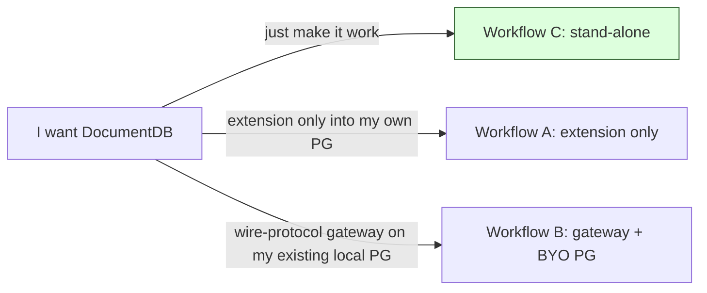

# DocumentDB Packaging Design (Track 1)

> **Status:** Design draft for final review.
>
> Track 1 is the package strategy for the current release: split packages, systemd-native conventions, a hosted apt repository for the paved road, and a documented install path that matches what the gateway architecturally supports today (local PostgreSQL with peer authentication and a narrow `pg_ident.conf` map).
>
> Track 2 (gateway refactor for cloud-managed PostgreSQL over TCP/password) is **deferred** to a follow-on effort and is **out of scope** for this design. See [§11 Deferred work](#11-deferred-work).
>
> This file is the single authoritative copy of the Track 1 packaging design. It absorbs and supersedes the earlier RFC-form draft (RFC-0007, "Linux distribution packaging for DocumentDB"), including that draft's decision log and open questions — see [§12 Decision log](#12-decision-log).

---

## Contents

1. [Scope and goals](#1-scope-and-goals)
2. [Design constraints](#2-design-constraints)
3. [The promise (one line per package)](#3-the-promise-one-line-per-package)
4. [The four packages](#4-the-four-packages)
5. [User workflows](#5-user-workflows)
6. [Behavior matrix](#6-behavior-matrix)
7. [Security posture](#7-security-posture)
8. [Tool inventory](#8-tool-inventory)
9. [Packaging ownership boundary](#9-packaging-ownership-boundary)
10. [Known limitations (by design)](#10-known-limitations-by-design)
11. [Deferred work](#11-deferred-work)
12. [Decision log](#12-decision-log)

---

## 1. Scope and goals

**Problem.** The DocumentDB gateway and extension were previously shipped only as a single Docker image (`ghcr.io/documentdb/documentdb/documentdb-local:latest`) and via a `cargo run` developer flow. There was no native Linux package, no systemd lifecycle, no apt/yum install path, and no contract that distro maintainers could build against. Operators who wanted DocumentDB on a long-lived host had to either run a container or build from source.

This design defines a package shape that lets administrators install DocumentDB with `apt install` (paved road) or `dnf install` (community channel) and manage it with `systemctl`, while keeping the existing Docker and developer paths working unchanged.

### In scope

- Define a four-package shape for both `.deb` and `.rpm` outputs — `postgresql-N-documentdb` (extension), `documentdb-postgresql-tools` (PostgreSQL administrator helpers), `documentdb-gateway` (wire-protocol translation layer), and `documentdb-N` + `documentdb` meta (stand-alone package) — while limiting first-party build/host/test commitments to the apt paved road.
- Adopt systemd-native conventions for service users, runtime directories, hardened sandboxing, and a single public systemd target (`documentdb-local.target`) so the stand-alone package's day-2 lifecycle — start, stop, restart, enable-on-boot — goes through one `systemctl` name.
- **Paved road:** build, host, and test one opinionated combination — **Ubuntu 24.04 LTS + PostgreSQL 18** — via a self-hosted apt repository. The package shape remains version-parametric so community channels can publish additional PostgreSQL majors where it is worth the friction, but this design does **not** commit the core project to every major/version permutation. Additional majors and their retirement are intentionally outside this packaging spec and would require a separate support-policy decision that is not yet defined in this repo. Other distros (Debian 12, Ubuntu 22.04, RHEL 9 / Fedora) are likewise community channels: **Fedora COPR** for the RPM family and **PGDG-style** conventions for additional deb packaging. See Non-goals below.
- Document and ship the workflow the gateway architecture genuinely supports today.

### Out of scope (deferred)

- **Docker images.** The existing `ghcr.io/documentdb/documentdb/documentdb-local:latest` image keeps being built by existing CI; this design does not modify it. Refactored, layered images (lean gateway image, separate `postgres-documentdb` image) are deferred.
- **Backend PostgreSQL topologies beyond the local paved road.** This design documents the same-host peer-auth path; an administrator who has already configured `trust` locally for the gateway OS user is also covered as a Workflow B precondition, but Track 1's package-managed registration writes peer + ident-map only. Cloud / remote PostgreSQL over TCP/password remains Track 2 capability work; see §2 and §11.1. The package shape does not need to change when that lands.
- **Production two-container compose.** Same blocker as above.

### Non-goals

The following are deliberately *not* commitments of this design. Keeping the paved road narrow lets us ship and support it well; the four-package split is shaped so each non-goal item is achievable by community packagers without core changes.

- **A maintained build matrix across every distro × every PG major.** We build and test the paved-road combination (Ubuntu 24.04 LTS + PG 18). RHEL/Fedora builds are produced via Fedora COPR; builds for additional PG majors or other distros rely on PGDG conventions and community packagers. We do not commit to producing or testing every cell, and we do not promise indefinite packaging for older PostgreSQL majors.
- **Side-by-side stand-alone installs for multiple PG majors as a first-class product story.** The package shape supports it (per-major naming, per-major paths/ports), but the paved-road flow is one PG major per host. Multi-major remains documented as an advanced capability (see §4.4); paved-road testing is single-major only.
- **A first-party documented/tested backend topology beyond the local paved road.** Cloud / remote PostgreSQL over TCP/password remains out of scope for Track 1; see "Out of scope (deferred)" and §11.1.

### What "done" looks like

- On the paved-road target (**Ubuntu 24.04 LTS + PostgreSQL 18**), `apt install documentdb` from our hosted apt repository pulls the stand-alone package and its dependencies.
- For community RPM channels, enabling the corresponding **Fedora COPR repo** makes `dnf install documentdb` follow the same high-level four-package contract, while distro-specific config mechanics differ.
- `sudo documentdb-setup` creates a DocumentDB instance backed by either a new or existing PostgreSQL instance, backing up configuration before making changes and supporting rollback.
- `sudo systemctl enable --now documentdb-local.target` brings up a working DocumentDB endpoint on port 10260.
- Purging the stand-alone package(s) removes package-managed services/configuration and restores managed config blocks, but preserves PostgreSQL data directories and database contents. Destructive data removal for stand-alone-package-owned private PostgreSQL state is only through `documentdb-local-reset --pg-version N --confirm-destroy`.
- The existing `documentdb-local` Docker image keeps building from existing CI without changes.

---

## 2. Design constraints

These are the user-facing realities the design must respect.

| Constraint | Why it matters for the design |
|---|---|
| Supported install path uses local passwordless PostgreSQL connections | The paved-road deployment puts the gateway and PostgreSQL on the same host with peer auth via Unix socket. Other backend topologies are configuration choices outside this design's scope; remote/TCP/password support still depends on Track 2 gateway work. |
| Package-managed gateway registration requires PostgreSQL 16+ | The gateway opens each authenticated client's data-pool connection **as that client's own role** over the local socket with an empty password (SCRAM verifies the client at the wire level; there is no plaintext to forward). It therefore depends on a `pg_ident.conf` map that resolves the gateway OS user to the requested member role via `+role` group membership — a matching capability PostgreSQL introduced in **version 16**. On PostgreSQL ≤15 that mapping never matches and there is no password-based fallback, so `documentdb-register-gateway` and `documentdb-setup` **reject PostgreSQL 15** (their `--restore` paths still work). PostgreSQL 15 stays supported for **extension-only** use (`CREATE EXTENSION documentdb`). The legacy `documentdb-local` container image uses a separate container-local `trust` model and is unaffected. |
| Advanced multi-major PostgreSQL coexistence on the same host | The package shape preserves per-major package names (`postgresql-N-documentdb`, `documentdb-N`), per-major file paths, and per-major systemd template instances for upgrade/migration scenarios. Each stand-alone PostgreSQL instance has at most one managed gateway, and Track 1 does not define a package-managed "many gateways against one PostgreSQL instance" topology. The paved road remains one major per host. |

---

## 3. The promise (one line per package)

| Package | Promise |
|---|---|
| `postgresql-N-documentdb` | "I extend your PostgreSQL major N. I install extension files only and do not configure PostgreSQL instances." |
| `documentdb-postgresql-tools` | "PostgreSQL administrator helpers (`documentdb-tune`, `documentdb-createcluster`, `documentdb-register-gateway`, future doctor commands). Optional for extension-only use. Required by the stand-alone package." |
| `documentdb-gateway` | "Wire-protocol translation layer. I am the runtime package only: systemd unit, binary, env sample, and connectivity check." |
| `documentdb-N` | "I make a DocumentDB instance work on this machine. Greenfield (I `initdb` my own private underlying PostgreSQL instance) or brownfield (I adopt an existing underlying PostgreSQL instance, with consent prompts before each invasive change). Co-installable with other PG majors." |

`documentdb-postgresql-tools` is a deliberate split from `postgresql-N-documentdb`: the pure extension package contains only the extension files, matching what Citus, pgvector, pg_cron, and TimescaleDB ship. Administrators who need PostgreSQL-side setup (`documentdb-tune`, `documentdb-createcluster`, or `documentdb-register-gateway`) install `documentdb-postgresql-tools` explicitly. The stand-alone package pulls it in automatically.

---

## 4. The four packages

### 4.1 `postgresql-N-documentdb` (extension only)

**Purpose:** ship the `documentdb` PostgreSQL extension for major version N. Per-major naming follows PGDG convention (matches `postgresql-N-cron`, `postgresql-N-pgvector`, etc.).

**What it installs (high level):**
- Extension shared libraries and SQL definitions under `/usr/lib/postgresql/N/lib/` and `/usr/share/postgresql/N/extension/`.
- Documentation that points administrators to `documentdb-postgresql-tools` for the inert config sample and tuning helper.

**Dependencies (summary):** `postgresql-N`, `postgresql-N-cron`, `postgresql-N-pgvector`, `postgresql-N-postgis-3`, `postgresql-N-rum` (PG ≤17) or built-in (PG 18+). Suggests `documentdb-postgresql-tools`.

**Mutates on install:** nothing.

**Does not:** edit `postgresql.conf` of running PostgreSQL instances, restart PostgreSQL, or run `CREATE EXTENSION`.

---

### 4.2 `documentdb-postgresql-tools` (PostgreSQL administrator helpers)

**Purpose:** ship administrator helpers that make a PostgreSQL instance DocumentDB-ready, with or without one managed local gateway attached.

**What it installs:** `/usr/bin/documentdb-tune`, `/usr/bin/documentdb-createcluster`, `/usr/bin/documentdb-register-gateway`, `/usr/share/doc/documentdb-postgresql-tools/examples/documentdb.conf.sample`, and documentation. The sample is intentionally inert: PostgreSQL's native include support (`include`, `include_if_exists`, `include_dir`) exists across the supported majors, and `include_dir` only loads files ending in `.conf`, so the managed fragment is named `documentdb.conf` while the example follows PostgreSQL's own `.sample` convention. This is a packaging/layout convention, not a new PostgreSQL-version boundary: the supported majors all support include files, while whether a PostgreSQL instance already exposes a `conf.d`-style directory depends on distro packaging. On Debian/Ubuntu it also installs a harmless global `createcluster.d` hook:

```conf
add_include_if_exists = '/etc/postgresql-common/documentdb/%v/%c/documentdb.conf'
```

Administrators can activate the extension settings in one of two ways:
1. **Recommended:** run `documentdb-tune`, which writes the active per-instance `documentdb.conf` file, records the managed changes for `--restore`, and tells the administrator whether reload or restart is required.
2. **Manual:** copy the inert sample to an active `.conf` file in the target PostgreSQL instance's existing include directory, for example `conf.d/99-documentdb.conf` or `postgresql.conf.d/99-documentdb.conf`, then reload or restart PostgreSQL as required by the changed settings.

The Debian/Ubuntu tuning flow is intentionally explicit:
1. `pg_createcluster` owns `/etc/postgresql/N/C/postgresql.conf`.
2. The hook adds one `include_if_exists` line for newly-created PostgreSQL instances.
3. `documentdb-tune --pg-version N --cluster C --yes` creates or removes the matching per-instance fragment, for example `/etc/postgresql-common/documentdb/N/main/documentdb.conf`.
4. The administrator reloads or restarts PostgreSQL.

The RHEL/Fedora RPM flow is different because there is no `postgresql-common` or `createcluster.d` hook model there. The RPM path is: `documentdb-tune` targets the selected PostgreSQL instance only when the administrator invokes it, and writes a clearly marked managed block directly into that instance's `postgresql.conf` (the same block-marker mechanism used on Debian when `--pgdata` is given). It does not probe for or write into a `conf.d`-style drop-in directory on RHEL; the managed-block edit is the RHEL contract.

For Debian/Ubuntu PostgreSQL instances that predate the tools package (created before the `createcluster.d` hook was installed, so their `postgresql.conf` has no `include_if_exists` pointing at the fragment), the first `documentdb-tune --yes` adds that single managed `include_if_exists` line to `postgresql.conf` if it is missing, then writes the fragment under `/etc/postgresql-common/documentdb/N/C/documentdb.conf`. The tuning content therefore lands in the postgresql-common fragment (activated by one include line), not inside the cluster's own `conf.d`. On RHEL (or whenever `--pgdata` is given), where there is no postgresql-common layout, `documentdb-tune` instead writes a clearly marked managed block directly into the target `postgresql.conf`.

Gateway registration is also explicit and lives here for the same reason: it mutates the PostgreSQL instance, not the gateway runtime package. `documentdb-register-gateway` writes the managed `pg_hba.conf` / `pg_ident.conf` blocks for one PostgreSQL instance, creates or reuses the gateway PG role, and writes the gateway connection file for the paired local gateway service. It requires the `documentdb-gateway` package to already be installed so the `documentdb-gateway` OS user, service unit, and config directories exist; if that runtime package is missing, the tool exits with a clear prerequisite error rather than partially editing PostgreSQL.

**Track 1 boundary:** this package owns **all PostgreSQL-side mutations** — `postgresql.conf`, `pg_hba.conf`, `pg_ident.conf`, and the gateway PG role. The `documentdb-gateway` package is intentionally runtime-only. Track 1 models **one managed local gateway per PostgreSQL instance**; a future many-gateways-to-one-PostgreSQL topology would need a more explicit gateway-instance model and is out of scope here.

**Dependencies (summary):** `postgresql-common` on Debian; `jq` is also pulled in because `documentdb-gateway-admin` parses JSON output from `psql -A -t` extension probes. `Suggests:` (not `Depends:` or `Recommends:`) `documentdb-gateway` — `documentdb-postgresql-tools` is PostgreSQL administrator scaffolding that is useful even before the gateway runtime package is installed (e.g., previewing the managed fragment via `--dry-run`). It deliberately does **not** `Suggests:` the per-major `postgresql-N-documentdb` packages: the tools are PostgreSQL-version-agnostic, so suggesting a specific major would be misleading on hosts running other majors.

**Mutates on install:** no existing PostgreSQL instances. The package only installs files; it has no maintainer-script side effects.

**Why a separate package:** putting config-mutating CLIs in the pure extension package weakens its PGDG-clean shape, and putting them in the gateway runtime package blurs the runtime/config boundary. None of Citus, pgvector, pg_cron, or TimescaleDB ship config-editing tooling in their extension packages. The bar for upstream-Debian acceptance is "the extension package contains only the extension." This design applies the same principle to the gateway: the gateway package stays runtime-only, while `documentdb-postgresql-tools` owns the explicit, administrator-invoked PostgreSQL-side setup steps for both extension enablement (`documentdb-tune`) and local gateway attachment (`documentdb-register-gateway`). That keeps headless installs clean, keeps the runtime package lean, and makes the boundary easy to explain.

The stand-alone package `documentdb-N` **`Depends:`** on `documentdb-common`, which owns the `documentdb-setup` wizard and in turn **`Depends:`** on `documentdb-postgresql-tools` (not `Suggests:`) — the wizard invokes `documentdb-tune` and `documentdb-register-gateway`, so the stack cannot function without them.

---

### 4.3 `documentdb-gateway` (wire-protocol translation layer)

**Purpose:** ship the wire-protocol translation layer, packaged as a systemd-managed service, suitable for use with the stand-alone package or in an independent deployment against a local PostgreSQL instance on the same host.

**What it installs (high level):**
- `/usr/bin/documentdb-gateway` — a thin wrapper over the daemon binary at `/usr/lib/documentdb-gateway/documentdb-gateway-daemon`. The systemd unit and the utility flags (`run`, `--check`, `--version`) go through the wrapper, which sources the per-major or global `gateway.env`, rejects any inline `DOCUMENTDB_PG_URL` (which the daemon ignores and which could otherwise leak a password via `/proc/<pid>/environ`), and — for root-shell invocations outside systemd — `runuser`-downgrades to the `documentdb-gateway` OS user before exec'ing the daemon. This wrapper+daemon split is a deliberate refinement of the original single-binary shape: it makes a manual `documentdb-gateway --check` behave exactly like the systemd path (env sourced, privileges dropped) instead of reading only the JSON compat config. The wrapper is single-sourced at `oss/packaging/gateway/documentdb-gateway-wrapper.sh` and installed verbatim by both the DEB build and the RPM spec.
- A hardened systemd service unit and matching `sysusers.d` / `tmpfiles.d` files for the OS user and runtime directories.
- A sample environment file at `/usr/share/doc/documentdb-gateway/examples/gateway.env.sample`; the live file remains `/etc/documentdb/gateway/gateway.env` when the administrator chooses to create it.
- Documentation and connection-string examples.

**Dependencies (summary):** no product-specific runtime dependency beyond the OS/runtime libraries that the binary links to (auto-detected via `dpkg-shlibdeps` against the daemon ELF) plus `openssl` for the TLS auto-generation flow. The gateway package declares **no `Suggests:` on the per-major `postgresql-N-documentdb` packages** — the gateway is PostgreSQL-version-agnostic, and suggesting a specific major (which apt would surface, or with `Recommends:` silently install) would mislead users who only want the gateway runtime.

**Invocation surface (explicit `run` subcommand plus utility flags):**

| Invocation | Purpose |
|---|---|
| `documentdb-gateway run` | Explicit service-mode entry point. |
| `documentdb-gateway --check` | End-to-end connectivity probe; the post-install smoke test once `documentdb-register-gateway` (or `documentdb-setup`) has finished writing the gateway's connection file and PostgreSQL-side wiring. Runs through the same wrapper + env-sourcing path as the service, opens a connection through the gateway's own pool (peer auth via the `documentdb-gateway-map` ident map → gateway PG role), confirms the `documentdb` extension is present in the target database, and prints the installed extension version; exits non-zero on any failure. Because it exercises the same startup code path as the daemon, a green `--check` strongly implies a successful service start. |
| `documentdb-gateway --version` | Utility flag for version info. |

**Why there is no `setup` subcommand here:** PostgreSQL-side gateway integration mutates the PostgreSQL instance, so this design keeps that logic in `documentdb-postgresql-tools` (`documentdb-register-gateway`) instead of the runtime package. That makes the package boundary crisp: `documentdb-gateway` is the runtime artifact; `documentdb-postgresql-tools` owns local PostgreSQL configuration; `documentdb-setup` is the higher-level stand-alone wrapper.

**Configuration:** systemd reads `EnvironmentFile=-/etc/documentdb/gateway/gateway.env`; the leading `-` means the live file is optional. The package ships `/usr/share/doc/documentdb-gateway/examples/gateway.env.sample` rather than a pre-created live file, matching PostgreSQL's own `.sample` naming (`postgresql.conf.sample`, `pg_hba.conf.sample`, `pg_ident.conf.sample`). Administrators who need non-default listen/TLS/state settings copy the sample into place, edit it, and restart the service.

**Transitional back-compat:** for pre-Phase-3 deployments that were configured with `/etc/documentdb/gateway/SetupConfiguration.json`, the package still ships that file (marked as a dpkg `conffile` so administrator edits survive upgrades) and the binary still loads it before falling back to env-only. The wizard (`documentdb-setup`) also still rewrites `PostgresPort`, `GatewayListenPort`, `PostgresHostName`, `PostgresSystemUser`, and `PostgresDataUser` in that JSON during apply — this is required for the no-systemd fallback path inside the existing `ghcr.io/documentdb/documentdb/documentdb-local:latest` Docker image, where the gateway is launched as `documentdb-gateway <SetupConfiguration.json>` rather than via the systemd unit. In every other supported path (the systemd-managed `documentdb-gateway-local@N.service` and `documentdb-gateway.service` units), the per-major `gateway.env` file is the authoritative source of truth: `DOCUMENTDB_PG_URL_FILE` and `DOCUMENTDB_LISTEN_ADDR` from the env file override any conflicting JSON field, and Track 1's role / connection-file decisions are recorded only in the env file. The JSON file is therefore best understood as a compat shim for the Docker/no-systemd path; it will be retired in a future revision once that path is refactored. **TODO(track-2):** delete the JSON shim and update the Docker image to source `gateway.env`.

Two different credential concepts appear in this design and they are easy to confuse:

1. **Gateway-to-PostgreSQL identity (runtime).** In the documented Track 1 flows, the gateway runs as the OS user `documentdb-gateway` and connects to a **local** PostgreSQL instance over a Unix socket. `pg_hba.conf` + `pg_ident.conf` map that OS user to the PostgreSQL role(s) the gateway is allowed to assume. So the gateway's connection file (`DOCUMENTDB_PG_URL_FILE`) identifies **where** PostgreSQL is and **which local role mapping to use**, but for Track 1 it does **not** contain a PostgreSQL password. This is why the doc keeps saying "local peer auth" and why `documentdb-register-gateway` owns the `pg_hba.conf` / `pg_ident.conf` edits plus the gateway role creation. The default connection-file path for per-major stand-alone installs is `/var/lib/documentdb-local/N/gateway/pg-url` (mode `0640`, owner `root:documentdb-gateway`), written by `documentdb-register-gateway` / `documentdb-setup`; it lives in the persistent per-major working directory so it survives reboot (a `/run`-based path would be cleared by tmpfs and the gateway env file's `DOCUMENTDB_PG_URL_FILE` pointer would dangle on next boot). For Workflow B without the stand-alone wrapper, the same file path is the documented convention but the administrator supplies the exact value through `gateway.env`.
2. **DocumentDB admin user credential (bootstrap/day-2).** Separately, the first product-facing admin user may need a password so that `mongosh` and applications can authenticate through the wire protocol. That password belongs to the client-facing DocumentDB login, not to the gateway. In interactive setup the CLI may simply prompt for it on the terminal; `--admin-password-file` is the non-interactive / scripted form. It is **not** the password the gateway uses to reach PostgreSQL.

Other backend topologies are left to administrator configuration, but the current gateway still lacks remote/TCP/password support. In Track 1, the connection file remains passwordless and points at a local Unix-socket PostgreSQL endpoint; password-bearing connection-file variants are deferred to Track 2. **The inline `DOCUMENTDB_PG_URL` environment variable is unsupported and is rejected** — the `documentdb-gateway` entrypoint exits with an error rather than starting, because the daemon reads only `DOCUMENTDB_PG_URL_FILE`; honoring an inline URL would both misconfigure the daemon and risk leaking an embedded password via `/proc/<pid>/environ`.

Optional configuration includes:
- listen address (default `:10260`)
- TLS cert/key files; if neither is set, `DOCUMENTDB_TLS_AUTO_GENERATE=true` is the documented default in stand-alone setup and is what the Workflow C and Workflow B examples assume (auto-generated self-signed certificate). Administrators who supply their own cert/key set this to `false`.
- state directory
- log level (`DOCUMENTDB_LOG_LEVEL`)

Note: an extension/gateway version compatibility check is **deferred** for Track 1 — the runtime does not currently enforce one, and the corresponding env var is intentionally not exposed. It will be reintroduced together with the actual compat-check implementation as part of a future packaging-design revision.

**Service:** runs as the unprivileged `documentdb-gateway` OS user under a hardened systemd unit (no privilege escalation, private tmp/devices, read-only filesystem except its state and runtime directories, restricted syscalls and address families, write-execute memory denied).

**Mutates on install:** creates the `documentdb-gateway` OS user and runtime directories via `sysusers.d`/`tmpfiles.d`. **Does not start the service. Does not touch PostgreSQL.**

**Mutates on administrator invocation:** none in Track 1. PostgreSQL-side gateway registration lives in `documentdb-postgresql-tools` (`documentdb-register-gateway`). The runtime package itself only provides the service, binary, env sample, and connectivity probe.

---

### 4.4 `documentdb-N` (stand-alone package, per PG major) + `documentdb` (meta)

**Purpose:** make DocumentDB just work on this machine. Pulls in the `postgresql-N-documentdb` extension package, the gateway package, and the administrator tooling, owns the DocumentDB instance lifecycle, exposes a single systemd target for day-2 lifecycle.

**Naming:**
- `documentdb-N` — per-major stand-alone package naming pattern. Paved-road builds and tests **`documentdb-18`**. Additional `documentdb-N` packages may exist via community packaging for PostgreSQL majors that community channels choose to keep active; this spec does not promise that every historical major gets a package forever.
- `documentdb` — small meta/alias package depending on the paved-road default major (**`documentdb-18`**) and owning the public systemd alias.

**Co-installable across majors (advanced capability).** The stand-alone package follows PGDG's pattern: `documentdb-18` and `documentdb-19` can be installed side-by-side, just like `postgresql-18` and `postgresql-19`. The byte-identical, major-agnostic shared payload is owned once by the `documentdb-common` package that every `documentdb-N` depends on, so the per-major packages carry no conflicting shared files and removing one major never disturbs another (see §10.6). This is an advanced capability for staging and migration workflows, not the paved-road story. Each stand-alone DocumentDB instance owns exactly one underlying PostgreSQL instance and one gateway, so side-by-side installs require the administrator to assign distinct public gateway ports for the non-default instances; this is manual configuration, not automatic allocation.

The meta package `documentdb` is intentionally opinionated: in first-party packages it is a fixed pointer to `documentdb-18`, and `documentdb-local.target` is a fixed alias to `documentdb-local@18.target`. Administrators running another major act on that major's per-instance target directly (`documentdb-local@N.target`). Community packagers may choose a different fixed alias target, but the design does not define a routine in-place "switch the default major" workflow for existing installations.

**Dependencies (summary):** `documentdb-N` **`Depends:`** on `postgresql-N`, `postgresql-N-documentdb (>= ${binary:Version})`, and **`documentdb-common (>= ${binary:Version})`** (hard). `documentdb-common` — the PG-agnostic shared payload that owns `documentdb-setup` — in turn **`Depends:`** on `documentdb-gateway (>= ${binary:Version})` and `documentdb-postgresql-tools (>= ${binary:Version})` (hard, not Suggests), because `documentdb-setup` invokes `documentdb-tune` and `documentdb-register-gateway`, so the stack cannot function without them. The packages still release in lockstep — the setup wizard, the `gateway-local@N.service` template, and the gateway runtime are validated together against one version — but every floor is expressed as `>=`, not an exact `=` pin. An exact `(= ${binary:Version})` pin deadlocks staggered point-release uploads: apt refuses to install `documentdb-N 0.114.1` while `documentdb-common` (or `documentdb-gateway`) is momentarily still `0.114.0`. The `>=` floor preserves the release-together intent without blocking incremental upgrades, and matches the extension and tools packages.

**Owned paths (per-major):**

| Path | Purpose |
|---|---|
| `/var/lib/documentdb-local/N/data` | PG data directory for major N (initdb here). |
| `/var/lib/documentdb-local/N/gateway` | Gateway working dir (TLS state) for major N. Created **root-owned** by `documentdb-register-gateway` (`install -d -m 0750 -o root -g documentdb-gateway`), and idempotently re-ensured by the unit's privileged `ExecStartPre=+install -d …` so `WorkingDirectory=` is always valid even if `documentdb-setup` has not pre-created it (avoids a `status=200/CHDIR` start failure). Also persistent location of the connection-URL file `pg-url` (`root:documentdb-gateway` `0640`) — see §4.3. The dir is intentionally **not** a systemd `StateDirectory=`: `StateDirectory` recursively chowns the directory and its contents to the unit's `User=` on every start when ownership differs, which would re-own `pg-url` to the gateway user and let the gateway rewrite/replace its own connection URL. Keeping the dir root-owned `0750` (and `install -d`, which never recurses into contents) preserves `pg-url`'s root ownership so the gateway can read it but cannot unlink or overwrite it. |
| `/var/lib/documentdb-local/N/backups` | Reserved per-major location for stand-alone-package rollback records. Note: current tooling does **not** centralize backups here — `documentdb-tune` / `documentdb-register-gateway` write timestamped `*.documentdb-backup.<timestamp>.<rand>` sibling files next to each config they edit (see [Known limitations](#104-no-automatic-rollback-on-documentdb-tune-failure)). `documentdb-local-reset` removes this directory if it exists. |
| `/run/documentdb-local/N/postgresql` | Unix socket directory for major N. |
| `/var/log/documentdb-local/N` | Logs for major N. |
| `/etc/documentdb/local/N/setup.conf` | Per-major remembered greenfield setup config. Drives the per-major env file (`/etc/documentdb/local/N/gateway.env`) loaded by `documentdb-gateway-local@N.service`; the global `/etc/documentdb/gateway/gateway.env` is the Workflow B single-instance path. `documentdb-postgresql@N.service` activates only when this file exists (via `ConditionPathExists`), and `documentdb-gateway-local@N.service` likewise activates only when the per-major `gateway.env` exists (via `ConditionPathExists=/etc/documentdb/local/%i/gateway.env`), so both stand-alone units skip cleanly before `documentdb-setup` has run. Because `gateway.env` is written in both greenfield and brownfield modes (unlike greenfield-only `setup.conf`), the gateway unit also activates in brownfield, where the drop-in below re-points its ordering. When `documentdb-setup` itself starts the unit, it verifies the unit actually reached `active` (`systemctl is-active`) after `systemctl start` and fails fast with a `documentdb-register-gateway` hint if the `ConditionPathExists` gate silently skipped the start (e.g. on the `documentdb-register-gateway`-absent fallback path that never writes `gateway.env`), instead of blocking on a misleading 60s readiness timeout. |
| `/etc/documentdb/local/N/brownfield.conf` | Per-major remembered brownfield setup state, written under a different filename from `setup.conf` so the templated greenfield PG service does not activate against an adopted system PostgreSQL instance. Drives the `--restore` path and the brownfield gateway drop-in (see below). |
| `/etc/systemd/system/documentdb-gateway-local@N.service.d/brownfield.conf` | wizard-managed systemd drop-in written only in brownfield mode. Resets the unit's greenfield `Requires=`/`After=` and re-points them at the adopted PostgreSQL service unit (`postgresql@N-C.service` on Debian/Ubuntu or `postgresql-N.service` on RHEL) so boot ordering for `documentdb-local@N.target` is correct without the greenfield template needing to activate. Removed by `documentdb-setup --restore` and by the `documentdb-N` postrm / %postun. |

**Two OS users** (shared across majors):
- `documentdb-local` is both the OS user that owns the stand-alone PostgreSQL data directory and the PostgreSQL superuser created by `initdb --username=documentdb-local`; the names intentionally match so peer auth on the private socket maps the OS user 1:1 to the DB superuser.
- `documentdb-gateway` runs the gateway (created by the gateway package).

Per-major isolation lives in data/state/socket paths and systemd template instances, not in OS users.

Log rotation for `/var/log/documentdb-local/N` is a packaging detail that should be handled with distro-appropriate defaults when the stand-alone package is implemented; this Track 1 design does not define a bespoke rotation policy.

Private stand-alone PostgreSQL instances are intentionally outside `postgresql-common`'s cluster discovery model. `pg_lsclusters`, `pg_upgradecluster`, `pg_renamecluster`, and `sudo -u postgres psql` do not manage or connect to `/var/lib/documentdb-local/N/data`; administrators use `systemctl status documentdb-local.target` (or `documentdb-local@N.target`) and the DocumentDB tooling instead. Brownfield PostgreSQL instances adopted from the system PostgreSQL packages keep their existing discovery and ownership model.

#### Security model: peer auth + ident map

The gateway connects to PostgreSQL via Unix socket. Peer auth identifies it by its OS user name; a narrow `pg_ident.conf` map controls which DB roles that OS user is allowed to assume:

| Map name | OS user (from peer auth) | Allowed DB role |
|---|---|---|
| `documentdb-gateway-map` | `documentdb-gateway` | `documentdb-gateway` (the role created by `documentdb-register-gateway`, matching the OS user name) |
| `documentdb-gateway-map` | `documentdb-gateway` | `+documentdb_admin_role` (any role member of the admin group, created by `CREATE EXTENSION`) |
| `documentdb-gateway-map` | `documentdb-gateway` | `+documentdb_readwrite_role` |
| `documentdb-gateway-map` | `documentdb-gateway` | `+documentdb_readonly_role` |
| `documentdb-gateway-map` | `documentdb-local` | `+documentdb_admin_role` (wizard bootstrap path — see below) |
| `documentdb-gateway-map` | `documentdb-local` | `+documentdb_readwrite_role` |
| `documentdb-gateway-map` | `documentdb-local` | `+documentdb_readonly_role` |

The first four entries cover the gateway runtime path (the `documentdb-gateway` OS user assumes a documentdb role group when serving wire-protocol clients). The next three cover the **wizard bootstrap path**: `documentdb-setup` runs as root and downgrades to the `documentdb-local` OS user via `runuser` to invoke `psql` for steps like `CREATE EXTENSION` and the first-admin-user bootstrap. Those steps need to assume `+documentdb_admin_role` over peer auth on the same Unix socket, so the wizard's OS identity gets the same ident-map entries (without `documentdb-gateway`'s direct-role grant — only the group memberships, because `documentdb-local` is already the PG superuser and never needs to assume the gateway runtime role).

This means the gateway's runtime PostgreSQL access is managed by **OS identity + local PostgreSQL auth rules**, not by storing a PostgreSQL password for the gateway in the package-managed config. The separate admin password file used by `documentdb-setup` is only for bootstrapping the first DocumentDB login for clients such as `mongosh`.

The leading `+` means "any role that is a member of this group" ([Postgres docs](https://www.postgresql.org/docs/current/auth-username-maps.html)). This is the trust boundary: the gateway can assume any role in the documentdb role groups, but cannot become `postgres`, the PostgreSQL instance owner, or any application role. **`SUPERUSER` is never granted to DocumentDB users.**

#### Default ports

- **PostgreSQL:** assigned per major (15 → 9715, 16 → 9716, 17 → 9717, 18 → 9718, 19 → 9719) so the assignment is predictable and stable regardless of install order. Private stand-alone PostgreSQL instances never bind to port 5432, even when no system PostgreSQL is running; this guarantees no collision with unrelated PostgreSQL services on the host. Override via `documentdb-setup --pg-port` to another non-5432 port.
- **Gateway:** the paved-road gateway (`documentdb-18`) listens on 10260 (the public port). This is the only automatically configured public gateway port. In advanced multi-major setups, each additional stand-alone install has one gateway tied to its PostgreSQL instance, and the administrator must choose a unique public listen port (for example 10261, 10262, …) with `documentdb-setup --listen-port`; packages do not dynamically allocate or switch ports.

Port 10260 is the default everywhere to avoid colliding with an existing service on the standard wire-protocol port. Administrators who want that standard port can set `--listen-port 27017` (or `DOCUMENTDB_LISTEN_ADDR=:27017`) explicitly.

**Conflict handling is explicit, not automatic.** If the requested public gateway port is already in use — by another DocumentDB gateway, an existing service on 10260, or a service already bound to 27017 or any other chosen port — the setup/start step fails with a clear "address already in use" style error and tells the administrator to choose another port. The packages do **not** auto-increment, auto-steal, or silently rewrite an existing gateway to a new port, because that would make client connection strings unstable.

So the resolution path is:

1. **Paved-road / stand-alone flow:** keep 10260 for the primary instance. For any additional stand-alone instance, rerun setup with an explicit override such as `documentdb-setup --listen-port 10261`.
2. **BYO gateway flow (Workflow B):** set a unique listen address in `/etc/documentdb/gateway/gateway.env` (for example `DOCUMENTDB_LISTEN_ADDR=:10261`) before starting the service.
3. **If the administrator wants 27017:** that remains an explicit opt-in, and the same conflict rule applies — if 27017 is already occupied, setup/service start fails and the administrator must pick another port.

#### systemd: per-major template + public alias

For the stand-alone package, each major has its own templated unit instance. The template unit files are shipped by `documentdb-common` (shared, major-agnostic) and instantiated per-major, with the per-major instance lifecycle (enable/disable/restart) managed by `documentdb-N`:

- `documentdb-local@N.target` — composite target for major N.
- `documentdb-postgresql@N.service` — private PG instance for major N in greenfield mode.
- `documentdb-gateway-local@N.service` — stand-alone gateway instance for major N.

In greenfield/private-PG mode, the PG service and gateway service are `PartOf=` the per-major target — they stop and restart together when the administrator acts on the target. In brownfield/adopted-PG mode, the adopted PostgreSQL service remains outside the stand-alone target and keeps its existing administrator-owned lifecycle; the stand-alone target only owns the local gateway side and orders it after the adopted PostgreSQL service. Stopping `documentdb-local@N.target` in brownfield mode must therefore not stop the system PostgreSQL service. The plain `documentdb-gateway.service` from the `documentdb-gateway` runtime package remains the Workflow B surface; `documentdb-gateway-local@N.service` is the stand-alone-only template.

**Why a dedicated `documentdb-postgresql@.service` instead of the distro PostgreSQL units (rationale).** Greenfield deliberately ships its own PostgreSQL service template rather than reusing `postgresql@V-C.service` (Debian/Ubuntu) or `postgresql-N.service` (RHEL/Fedora) for the private instance:

1. **Debian's unit cannot address an unregistered cluster.** `postgresql@V-C.service` does not start PostgreSQL directly — it invokes `pg_ctlcluster`, which only manages clusters registered with `postgresql-common` (config under `/etc/postgresql/V/C/`). The private instance is a raw-`initdb` cluster in upstream layout (config inside the data dir, superuser `documentdb-local`), so a systemd drop-in overriding `User=` or environment cannot point the distro unit at it; postgresql-common registration is a prerequisite, not something a drop-in can supply.
2. **Registering the private instance would put the appliance inside the administrator's PostgreSQL fleet surface.** A registered cluster is enumerated by `pg_lsclusters`, auto-started by the postgresql-common generator via the umbrella `postgresql.service`, restarted by a routine `systemctl restart postgresql`, and is a valid target for `pg_upgradecluster` — which would move the data directory to a new major underneath per-major-coupled packaging (the `postgresql-N-documentdb` extension binary, the per-major 97xx port assignment, `setup.conf`, `gateway.env`, and `documentdb-local@N.target` all stay pinned to the old major), producing a half-upgraded appliance. Keeping the private instance out of the registry makes "generic PostgreSQL fleet tools do not apply here" structural rather than advisory; the supported major-migration path is [§10.2](#102-no-pg_upgrade-migration-helper).
3. **RHEL has no reusable unit.** PGDG's `postgresql-N.service` is a single-instance (non-template) unit with `PGDATA` baked in — one per major, and it belongs to the administrator's own PostgreSQL. Re-pointing it at `/var/lib/documentdb-local/N/data` would consume the host's only PostgreSQL-N service and break the supported coexistence of an administrator-owned PostgreSQL N (default port 5432) with the private instance (per-major 97xx port) on the same host. PGDG's own documented pattern for an additional instance is a dedicated unit file — which is exactly what this template is.
4. **Identity and consent.** Both distro units run as `User=postgres`, while the stand-alone security model requires the data-directory owner and PostgreSQL superuser to be `documentdb-local` for 1:1 peer auth (see the security model above). And under the §7 ownership rule — the tools never restart administrator-owned PostgreSQL units; `documentdb-setup --yes` and the target lifecycle may restart package-owned ones — the private instance must run under a unit the package owns for the wizard to automate it without breaching that consent boundary.

Reusing the distro units is not rejected — it is brownfield mode: adopted instances keep `postgresql@V-C.service` / `postgresql-N.service` (ordering re-pointed by the drop-in below), and Debian/Ubuntu administrators who want a postgresql-common-registered, `pg_upgradecluster`-capable backing instance can create one with `documentdb-createcluster` and adopt it via `--target-postgres-instance`.

**Brownfield drop-in mechanism (normative).** Because `Requires=`/`After=` in the shipped `documentdb-gateway-local@N.service` template are wired to the greenfield `documentdb-postgresql@%i.service` (which is gated by `ConditionPathExists=/etc/documentdb/local/%i/setup.conf` and therefore inactive in brownfield mode), brownfield needs a runtime override so the gateway is correctly ordered after the **adopted** PostgreSQL service. The gateway template's own `ConditionPathExists=/etc/documentdb/local/%i/gateway.env` gate is satisfied in both greenfield and brownfield (the wizard writes the per-major `gateway.env` in both modes), so the gateway still starts in brownfield while the greenfield PG unit stays skipped — only the ordering needs the drop-in. `documentdb-setup` writes a per-instance systemd drop-in at `/etc/systemd/system/documentdb-gateway-local@N.service.d/brownfield.conf` that:

1. **Resets** the templated `Requires=`/`After=` (with `Requires=` followed by the empty value to drop the previous list, then a new line pointing at the adopted unit).
2. **Re-points** boot ordering at the adopted PostgreSQL service unit — `postgresql@N-C.service` on Debian/Ubuntu, or `postgresql-N.service` on RHEL/Fedora.

The drop-in is owned by the wizard: written by `documentdb-setup` apply, removed by `documentdb-setup --restore`, and removed by the `documentdb-N` postrm / `%postun`. This keeps the shipped template file purely greenfield (no brownfield knowledge baked into the package-owned unit file) while still giving brownfield correct boot-time ordering. The same per-instance drop-in approach is reused if `documentdb-gateway-local@N.service` later needs other instance-specific overrides (TLS state dir, alternate working directory, etc.) without forking the template.

**Aliasing the public target.** Because systemd's native `Alias=` does not support template instances, the paved-road `documentdb-local.target` is implemented as a thin wrapper unit shipped by the `documentdb` meta package: the wrapper has `Requires=documentdb-local@18.target` + `After=…`, and a reverse `PartOf=` drop-in on `documentdb-local@18.target` propagates `stop`/`restart` from the wrapper to the per-major target. Day-2 commands (`enable`, `start`, `stop`, `restart`, `status`) on `documentdb-local.target` therefore behave identically to acting on `documentdb-local@18.target` directly.

The administrator controls a specific greenfield stand-alone stack with one verb:

```bash
sudo systemctl enable --now documentdb-local@N.target     # start the stand-alone stack for major N
sudo systemctl status documentdb-local@N.target           # see both services for major N
sudo systemctl restart documentdb-local@N.target          # ordered restart
sudo systemctl stop documentdb-local@N.target             # stop both
```

For the paved-road major, a top-level `documentdb-local.target` symlink (systemd alias) points at `documentdb-local@18.target` in first-party packages — so `systemctl enable --now documentdb-local.target` Just Works for the common single-major greenfield case. Advanced multi-major administrators act on `documentdb-local@N.target` directly. **`documentdb-local.target` is the public day-2 surface for the stand-alone package.**

#### `documentdb-setup` (the stand-alone package's setup wizard)

`documentdb-setup` is the single orchestration command administrators use after `apt install documentdb`. It handles greenfield (create a fresh private DocumentDB instance with its own underlying PostgreSQL instance) and brownfield (create a DocumentDB instance by adopting an existing PostgreSQL instance, with consent prompts) in the same flow.

Key flags (matches `documentdb-setup --help`):
- Targeting: `--use-new-postgres-instance` (force greenfield by creating a new backing PostgreSQL instance; deprecated alias `--use-private-cluster`), `--target-postgres-instance V/C` (build the DocumentDB instance on top of a specific Debian/RHEL PostgreSQL instance, named by the distro's existing identifier such as `18/main`; deprecated alias `--target-cluster`), `--data-dir DIR` (per-major default `/var/lib/documentdb-local/N/data`), `--pg-port N`, `--pg-version N`.
- Bootstrap: `--listen-port N` (alias `--gateway-port`), `--admin-user NAME` (alias `--username`). The first admin password can be supplied via `--admin-password-file FILE` (alias `--password-file`) for scripted installs, piped on stdin via `--admin-password-stdin`, or — in the typical interactive case — entered at a terminal prompt. The legacy `DOCUMENTDB_PASSWORD` env-var form is still accepted for compatibility but is **deprecated** (it leaks via `/proc/<pid>/environ`); use one of the three forms above instead. TLS for the gateway is configured via `--tls-cert FILE` / `--tls-key FILE` / `--tls-auto-generate {true|false}` on the wizard, which threads them through to the per-major `gateway.env` so the runtime gateway picks them up via `DOCUMENTDB_TLS_CERT_FILE` / `DOCUMENTDB_TLS_KEY_FILE` / `DOCUMENTDB_TLS_AUTO_GENERATE` (single source of truth whether the gateway was set up by `documentdb-setup` or `documentdb-register-gateway`).
- Behavior: `--yes` (non-interactive for CI), `--dry-run` (preview every invasive step the wizard would take, no side effects), `--verbose`.
- Lifecycle (read-only operational queries): `--print-config` (report the resolved per-major paths, ports, and templated systemd units the wizard would use; no side effects), `--status` (report the current per-major installation state — PG service / gateway service / listening port / state-file presence; exit 0 if a healthy install is found).
- Lifecycle (mutating): `--restore` (remove package-managed integration only; does not delete PostgreSQL data; `apt purge documentdb-N` triggers the same restore flow non-interactively), `--load-sample-data` / `--skip-init-data` (control built-in sample-data ingest after first install, requires `mongosh`), `--no-enable` (apply config but do not start the gateway service or enable `documentdb-local.target` at boot).

By default the wizard ends with `systemctl enable --now documentdb-local.target` (or `documentdb-local@N.target` for non-paved-road majors) as part of its own apply path, so the operator does not need to run a separate enable command. Pass `--no-enable` to skip **only** the gateway start and the boot-time enable of `documentdb-local.target`; the private PostgreSQL instance is still initialized and started (it has to be — `CREATE EXTENSION` and the first-admin bootstrap run against it), and all config is written. The wizard then prints the exact `systemctl enable --now` command to run when ready.

The bootstrap flags are a stand-alone-package convenience: when requested, `documentdb-setup` bootstraps the first admin user through the extension-side user-management API after the extension and gateway integration are in place. In the normal interactive path, `documentdb-setup` can prompt for that first user password directly on the terminal. `--admin-password-file` is the automation / CI form, not a requirement for ordinary installs. That bootstrap is intentionally above the `documentdb-gateway` package boundary.

Terminology in this design is intentional: a **DocumentDB instance** is the product-facing unit — one gateway paired with one underlying PostgreSQL instance. When the doc says **PostgreSQL instance**, it specifically means that underlying server/config surface. The setup flags therefore use PostgreSQL-oriented naming when the administrator is selecting that backing server directly: `--use-new-postgres-instance` provisions a new backing PostgreSQL instance, and `--target-postgres-instance` points at an existing one using the distro's existing identifier (for example `18/main` on Debian/Ubuntu). Lower-level PostgreSQL-side helpers keep the same convention: `documentdb-tune` keeps `--cluster` because it intentionally follows the established Debian/Ubuntu `pg_createcluster` / `pg_lsclusters` naming, while `documentdb-register-gateway` uses `--target-postgres-instance`.

For each invasive step (write `postgresql.conf` managed block, write `pg_hba.conf`, write `pg_ident.conf`, restart or reload PG, run `CREATE EXTENSION`, optionally bootstrap the first admin user through the extension-side user API), `documentdb-setup` itself prompts the administrator with a description and offers `[y/N/dry-run]`, then invokes the appropriate sub-tool (`documentdb-tune` or `documentdb-register-gateway`) or extension-side bootstrap step non-interactively to do the actual work. For system PostgreSQL instances, the tools print the required `systemctl restart` or `systemctl reload` command and the administrator runs it. For private stand-alone PostgreSQL instances, `documentdb-setup --yes` may restart or reload `documentdb-postgresql@N.service` directly because that service is owned by the stand-alone package. Before editing any config file, the tools write a timestamped `*.documentdb-backup.<timestamp>.<rand>` copy as a sibling of the file they touch (there is no centralized backup directory); the set of files touched, plus the paths needed to reverse them, is recorded in the per-major state files (`/etc/documentdb/local/N/setup.conf` or `brownfield.conf`). `--restore` and package purge use those state files to remove package-managed integration while leaving PostgreSQL data directories, extension state, users, and application data intact.

So `documentdb-setup` owns the administrator UX — the consent prompts, the dry-run preview, the rollback plan — while the sub-tools do the file edits. Administrators do not need to know or run the sub-tools directly.

**Safety properties:**
- Always write a timestamped backup before any file change.
- Refuse to mutate any config file containing **foreign** managed-block markers (markers from another tool we don't recognize). Print conflict, exit non-zero.
- Warn loudly when adopting a `postgres`-owned PostgreSQL instance (vs. an empty one we'd init ourselves), explain implications, require confirmation. Don't refuse — the user installed `documentdb`; that's the consent.
- `--restore` strips every managed block ever written across all PostgreSQL instances touched and removes package-managed service wiring/connection files, but does **not** delete PostgreSQL data directories, extension state, roles, users, or application data.
- `apt purge documentdb-N` invokes the same non-destructive restore via inline shell in `postrm`.

---

## 5. User workflows

Three install paths. **Workflow C (the stand-alone package) is the recommended default** for new users — a few commands, no packaging decisions to make. Workflows A and B are advanced paths for users with specific needs.



If you're not sure which to pick, pick **C**. The stand-alone package handles everything; you can move to A or B later if your needs change.

`documentdb-postgresql-tools` is the explicit way to make an administrator-managed PostgreSQL instance DocumentDB-ready. Use `documentdb-tune` for an existing PostgreSQL instance, or `documentdb-createcluster` when creating a fresh Debian/Ubuntu PostgreSQL instance.

The concrete command examples below are Debian/Ubuntu-shaped where that makes the instance identifiers explicit (`--cluster main`, `18/main`). For RPM-family community packaging, treat those identifiers as high-level equivalents rather than a normative CLI syntax in this Track 1 doc.

`--restore` scope differs by tool:
- `documentdb-tune --restore` removes only the managed PostgreSQL tuning/config fragments.
- `documentdb-register-gateway --restore` removes only the managed gateway registration wiring for a PostgreSQL instance.
- `documentdb-setup --restore` removes the stand-alone wrapper's package-managed integration across the surfaces it orchestrated. It sweeps every registered major by default (confirming first when more than one is found); `--pg-version N` scopes it to one major, and `--dry-run` previews the sweep without changing anything.

### Conventions used in the examples

**Default port: 10260.** All three workflows use port `10260` in the single-instance examples for the DocumentDB endpoint to avoid colliding with another service already using the standard wire-protocol port on the same host. Override with `DOCUMENTDB_LISTEN_ADDR=:27017` for that standard port. If that chosen port is already occupied, setup/start fails and the administrator must choose another explicit port; the tooling never auto-reassigns ports behind the user's back.

**Interactive prompt vs. password file.** The first admin password is for the **DocumentDB login being created for clients**, not for the gateway's own PostgreSQL connection. In an ordinary interactive install, `documentdb-setup` can just prompt for that password on the terminal. `--admin-password-file` is the non-interactive / automation form and is mainly useful for CI, scripted installs, or repeated local testing. Most examples below use the interactive path. Only use a password file for non-interactive examples such as CI or scripted installs:

```bash
# One-time: prepare the admin password file (interactive entry, no shell-history leak)
read -s -p "DocumentDB admin password: " PWFILE_CONTENT
PWFILE=$(mktemp) && chmod 600 "$PWFILE" && printf '%s' "$PWFILE_CONTENT" > "$PWFILE"
unset PWFILE_CONTENT
# After install: rm -f "$PWFILE"
```

If you choose to use `$PWFILE` in automation, it should contain the admin password and be mode `0600`.

**TLS in the connection string.** `tlsAllowInvalidCertificates=true` is correct for the gateway's auto-generated self-signed cert. For production, supply your own cert via `DOCUMENTDB_TLS_CERT_FILE`/`DOCUMENTDB_TLS_KEY_FILE` and drop the flag.

---

### Workflow C — Full stand-alone install (`apt install documentdb`) **[recommended default]**

**When to use:** the default path. Anyone who wants `apt install` → working DocumentDB in a few commands. In greenfield mode, the stand-alone package creates and owns a private underlying PostgreSQL instance. In brownfield mode, it layers a DocumentDB instance on top of an existing PostgreSQL instance, with consent prompts before each invasive change. Most users should pick this.

> ⚠ **PostgreSQL repository prerequisite (Debian/Ubuntu).** `documentdb` depends on `postgresql-18` (and matching `postgresql-18-cron` / `-pgvector` / `-postgis-3`) which is **not** in Ubuntu 24.04's default apt sources. Enable the PGDG repo first:
> ```bash
> sudo apt-get install -y curl ca-certificates gnupg lsb-release
> sudo install -d /usr/share/postgresql-common/pgdg
> curl -fsSL https://www.postgresql.org/media/keys/ACCC4CF8.asc \
>   | sudo gpg --dearmor -o /usr/share/postgresql-common/pgdg/apt.postgresql.org.gpg
> echo "deb [signed-by=/usr/share/postgresql-common/pgdg/apt.postgresql.org.gpg] https://apt.postgresql.org/pub/repos/apt $(lsb_release -cs)-pgdg main" \
>   | sudo tee /etc/apt/sources.list.d/pgdg.list
> sudo apt-get update
> ```
> On RHEL/Fedora the equivalent PGDG repo enablement is documented at <https://www.postgresql.org/download/linux/redhat/>. Minimal Rocky/Alma 9 hosts also need the **CRB** (CodeReady Builder) and **EPEL** repositories enabled because `postgis36_18` (a PGDG dep of the extension RPM) pulls in `hdf5` and `xerces-c` from there:
> ```bash
> sudo dnf install -y dnf-plugins-core
> sudo dnf install -y https://download.postgresql.org/pub/repos/yum/reporpms/EL-9-x86_64/pgdg-redhat-repo-latest.noarch.rpm
> sudo dnf -qy module disable postgresql
> sudo dnf config-manager --set-enabled crb
> sudo dnf install -y epel-release
> ```

```bash
# (1) Install the meta package (pulls in the stand-alone package + gateway + tools)
sudo apt install documentdb

# (2) Run the setup wizard — single command. The wizard prompts interactively
# for the first admin password, runs initdb / CREATE EXTENSION / first-user
# bootstrap, AND enables documentdb-local.target so the stack survives reboot.
# After this returns successfully the gateway is already running and the
# target is already enabled at boot — there is no separate "now enable the
# target" step.
sudo documentdb-setup --admin-user admin

# (3) Connect — the --eval round-trips a ping to prove it works
mongosh 'mongodb://admin@127.0.0.1:10260/mydb?tls=true&tlsAllowInvalidCertificates=true' \
        --eval 'db.runCommand({ping: 1})'

# Day-2:
#   sudo systemctl status  documentdb-local.target    # current state
#   sudo systemctl restart documentdb-local.target    # ordered restart of gateway + private PG
#   sudo systemctl stop    documentdb-local.target    # graceful stop of both
#   sudo documentdb-setup --restore                   # detach package-managed integration
```

`documentdb-setup` walks the administrator through either selecting an existing PostgreSQL instance or creating a fresh private one, then turns that into a managed DocumentDB instance with backup-and-rollback safety around each config-file modification. The command sequence above shows the default greenfield/private-PostgreSQL path; brownfield is selected by passing `--target-postgres-instance N/cluster` (Debian-style `pg_lsclusters` identifier) so the wizard adopts an existing PostgreSQL service instead of creating a private one. On an interactive terminal the wizard also detects existing adoptable PostgreSQL instances (via `pg_lsclusters`, filtered to majors where the `documentdb` extension is installed) and offers the brownfield path without the explicit flag; the `--target-postgres-instance` flag remains the documented contract for non-interactive/CI installs and for RHEL hosts, which have no `pg_lsclusters`.

Pass `--no-enable` if you want to defer starting the gateway and enabling `documentdb-local.target` at boot (for example to inspect state before exposing the endpoint). Note that the private PostgreSQL instance is still brought up during setup — `--no-enable` gates the gateway/target, not the backing PostgreSQL service. Without `--no-enable`, the wizard owns the full apply-then-enable path so the operator never has to remember a second command.

**What you get:** a full DocumentDB instance with the integration and gateway wiring managed by the stand-alone package. In greenfield mode, day-2 lifecycle is `systemctl <verb> documentdb-local.target` (or `documentdb-local@N.target` for a specific major when multiple are installed) because the package also owns the private PostgreSQL service. In brownfield mode, the stand-alone package still manages the DocumentDB integration and local gateway wiring, while the adopted PostgreSQL service remains under the administrator's existing lifecycle.

**What you don't get:** in greenfield mode, independent control over the private underlying PostgreSQL instance. In brownfield mode, you keep control of the adopted PostgreSQL service, but the stand-alone wrapper still owns the DocumentDB integration it layered on top. Use Workflow A or B if you want to manage those pieces separately end-to-end.

---

### Workflow A — Install the extension into a managed PostgreSQL instance *(advanced)*

**Primary intent:** install the `documentdb` extension into a PostgreSQL instance the administrator manages. This is for users whose primary interest is the extension itself — for example, ops/migration tooling, or as preparation for layering the gateway on top in Workflow B. The same install steps happen inside Workflow C; the stand-alone package just bundles them.

**Precondition:** PostgreSQL major N is already installed via the PGDG apt repo or your distro's package set. The examples below use **PostgreSQL 18** because that is the paved-road major; replace `18` with your target PG major when using community-built packages for another major.

**The next steps the administrator runs:**

```bash
# (1) Install the package
sudo apt install postgresql-18-documentdb

# (2) Materialize the managed DocumentDB config fragment
sudo apt install documentdb-postgresql-tools                        # ships documentdb-tune
sudo documentdb-tune --pg-version 18 --cluster main --dry-run       # preview
sudo documentdb-tune --pg-version 18 --cluster main --yes
sudo systemctl restart postgresql@18-main

# (3) Create the extension in the `postgres` database (the tune fragment
# pins cron.database_name='postgres', so pg_cron — pulled in via CASCADE —
# only allows extension creation there). If you need a custom DB name,
# either override cron.database_name in the per-instance documentdb.conf
# fragment before restart, OR keep the DocumentDB metadata in `postgres`
# and create your application data DBs separately.
sudo -u postgres psql -d postgres -v ON_ERROR_STOP=1 \
        -c 'CREATE EXTENSION documentdb CASCADE;'

# (4) Verify
sudo -u postgres psql -d postgres -c '\dx documentdb*'
# Should list: documentdb, documentdb_core, plus dependencies (pg_cron, pgvector, postgis, ...)
```

**Even simpler on Debian/Ubuntu when starting from scratch:**

```bash
sudo apt install postgresql-18-documentdb
sudo apt install documentdb-postgresql-tools
sudo documentdb-createcluster 18 main --start
sudo -u postgres psql -d postgres -v ON_ERROR_STOP=1 \
        -c 'CREATE EXTENSION documentdb CASCADE;'
```

`documentdb-createcluster` wraps `pg_createcluster` and `documentdb-tune`, so the PostgreSQL instance is created and the per-instance `documentdb.conf` fragment is written in one step. On Debian/Ubuntu the instance config stays under `/etc/postgresql/18/main/`, while the managed fragment lives at `/etc/postgresql-common/documentdb/18/main/documentdb.conf`. When `--start` is requested, the wrapper tunes the instance before starting it.

After verification the administrator has three options:

- **Stop here** — extension is available for ops/migration scripts via SQL.
- **Add the wire-protocol gateway** — continue with Workflow B.
- **Switch to the stand-alone package** — `apt install documentdb && sudo documentdb-setup` will detect the existing PostgreSQL instance (with the extension already loaded) and offer to use it; the wizard is brownfield-aware.

---

### Workflow B — Extension + gateway (BYO local PG with passwordless local auth) *(advanced)*

> ⚠ **The documented Workflow B path uses PostgreSQL on the same host with passwordless local authentication for the gateway OS user. `documentdb-register-gateway` writes a peer + ident-map block in `pg_hba.conf`; if the administrator's pre-existing config already grants trust for the same Unix socket, that satisfies the precondition as well. Cloud-managed or other remote TCP/password PostgreSQL backends are a Track 2 topic, not a supported/documented Track 1 flow.** See §2 and [§11.1](#111-track-2--gateway-byo-refactor-for-cloud--remote-postgresql). If you don't have local PG with passwordless auth available, use Workflow C instead.

**When to use:** a power user with a local PostgreSQL instance who wants a DocumentDB instance on top of it, without the stand-alone package taking ownership of the underlying PostgreSQL instance lifecycle.

**Precondition:** PostgreSQL major N is already installed via the PGDG apt repo or your distro's package set, configured to allow passwordless local connections (peer or trust auth in `pg_hba.conf`) for the gateway's OS user. The examples below use **PostgreSQL 18** because that is the paved-road major; replace `18` with your target PG major when using community-built packages for another major.

**Track 1 assumption:** one managed local gateway per target PostgreSQL instance. If you want multiple gateways against the same PostgreSQL instance, this design does not define package-managed role / `pg_hba.conf` / connection-file ownership for that topology; treat it as manual / deferred work.

```bash
# (1) Install both packages
sudo apt install postgresql-18-documentdb documentdb-gateway

# Optional: if you need a non-default public port, TLS paths, or state directory,
# copy the sample once and edit /etc/documentdb/gateway/gateway.env before start.
# sudo install -D -m 0640 /usr/share/doc/documentdb-gateway/examples/gateway.env.sample /etc/documentdb/gateway/gateway.env
# sudoedit /etc/documentdb/gateway/gateway.env

# (2) Apply PostgreSQL settings
sudo apt install documentdb-postgresql-tools
sudo documentdb-tune --pg-version 18 --cluster main --yes
sudo systemctl restart postgresql@18-main
sudo -u postgres psql -d postgres -c 'CREATE EXTENSION documentdb CASCADE;'

# (3) One-shot PostgreSQL-side gateway registration against the local PostgreSQL instance.
# Auto-detects when there is exactly one PostgreSQL instance on the host (typical case).
sudo documentdb-register-gateway --yes
sudo systemctl reload postgresql@18-main

# When you have multiple PostgreSQL instances, name the backing PostgreSQL instance explicitly:
#   sudo documentdb-register-gateway --target-postgres-instance 18/main --yes

# (4) Validate the configured connection before starting the service
sudo -u documentdb-gateway documentdb-gateway --check

# (5) Start
sudo systemctl enable --now documentdb-gateway

# (6) Bootstrap the first admin user through the extension-side user-management API.
# This non-interactive example reuses $PWFILE from the conventions section above.
# $PWFILE is mode 0600 owned by the invoking user, so the password is read in
# the invoking shell with $(cat ...) and handed to psql via -v; this avoids
# making PWFILE itself readable by the postgres user. The password appears
# briefly in psql's argv (visible to root and the postgres user via ps for the
# lifetime of the process), which is acceptable for this scripted bootstrap.
# Run this against the same database where CREATE EXTENSION was executed (postgres here).
sudo -u postgres psql -d postgres -X -v ON_ERROR_STOP=1 \
    -v admin_password="$(sudo cat "$PWFILE")" <<'SQL'
SELECT documentdb_api.create_user(
  jsonb_build_object(
    'createUser', 'admin',
    'pwd', :'admin_password',
    'roles', jsonb_build_array(
      jsonb_build_object('role', 'readWriteAnyDatabase', 'db', 'admin'),
      jsonb_build_object('role', 'clusterAdmin', 'db', 'admin')
    ),
    '$db', 'admin'
  )::text::documentdb_core.bson
);
SQL

# (7) Connect
mongosh 'mongodb://admin@127.0.0.1:10260/?tls=true&tlsAllowInvalidCertificates=true' \
        --eval 'db.runCommand({ping: 1})'
```

`documentdb-register-gateway` is a one-shot command that, against the targeted existing PostgreSQL instance:
- Creates a PG role matching the gateway's OS user (or reuses if present).
- Writes a managed block to `pg_hba.conf` (peer auth with named ident map).
- Writes a managed block to `pg_ident.conf` mapping the gateway OS user to the documentdb role groups.
- Prints the required PostgreSQL reload command for system PostgreSQL instances; PostgreSQL instances owned by the stand-alone package may be reloaded by `documentdb-setup --yes`.
- Writes the gateway's connection URL file (mode `0640`, owner `root:documentdb-gateway`).
- Requires the `documentdb-gateway` runtime package to already be installed; otherwise it exits with a clear prerequisite error.
- Records package-managed integration so `documentdb-register-gateway --restore` (and `documentdb-setup --restore` when using the stand-alone wrapper) can detach the local gateway wiring cleanly without deleting PostgreSQL data directories or in-database contents.

Without `--yes`, the command is interactive: it shows what it will change and prompts before each invasive step. `--dry-run` previews all changes without writing.

The PostgreSQL instance's `postgresql.conf` is **not** modified by `documentdb-register-gateway` — that's `documentdb-tune`'s job. The two tools compose: `documentdb-tune` handles `postgresql.conf`; `documentdb-register-gateway` handles `pg_hba.conf`/`pg_ident.conf` plus the role and connection file. First-user bootstrap intentionally stays outside the gateway package so headless and gateway-backed deployments can use the same extension-side user-management model.

**What you get:** a DocumentDB instance backed by your chosen PostgreSQL instance, with the wire protocol, full SCRAM authentication, and the same gateway capabilities the stand-alone package provides.

**What you don't get:** a first-party documented/tested path for a remote or password-authenticated PostgreSQL backend; that capability is deferred to Track 2. You also do not get stand-alone-package-managed DocumentDB instance lifecycle (use Workflow C if you want that).

---

### After any workflow

The `mongosh` examples above omit `--password`, so `mongosh` prompts on stdin instead of exposing the password in shell history or the process list. For one-off trusted-host smoke tests, administrators may construct a short-lived URI from `$PWFILE`, but any password placed on a command line is visible through tools such as `ps` for the lifetime of the process and is not a production monitoring pattern.

If you used a password file for a non-interactive example, don't forget to remove it:

```bash
rm -f "$PWFILE"
```

### Workflows NOT in this release

- **Docker evaluation** — the existing `ghcr.io/documentdb/documentdb/documentdb-local:latest` image keeps building from existing CI; this design does not modify it. Refactored, layered Docker images are deferred.
- **Cloud / remote PG over TCP/password as a supported/documented workflow** — Track 2.
- **Production two-container compose** — same blocker as above. Track 2 + Docker work.

---

## 6. Behavior matrix

The bolded cells are the only places `postgresql.conf`, `pg_hba.conf`, or `pg_ident.conf` are modified on the forward path. All happen only on explicit administrator invocation, never on package install. The reverse path (`apt purge documentdb-N` / `dnf erase`) runs the same `--restore` logic from the package's `postrm` / `%postun`, removing managed blocks and managed fragments without deleting PostgreSQL data; this is the only non-CLI-driven config rollback in the design.

| Action | `postgresql-N-documentdb` install | `documentdb-gateway` install | `documentdb-N` install | `documentdb-tune` | `documentdb-register-gateway` | `documentdb-setup` |
|---|---|---|---|---|---|---|
| Install extension files | Yes | No | Via dep | No | No | No |
| Install gateway binary | No | Yes | Via dep | No | No | No |
| Create OS service user | No | Yes (sysusers.d, eager) | Yes (sysusers.d, eager) | No | No | Ensure/reuse |
| Create gateway PG role | No | No | No | No | Yes | Delegates to `register-gateway` |
| `initdb` | No | No | No | No | No | Yes (greenfield mode) |
| Edit `postgresql.conf` | No | No | No | **Yes (managed fragment preferred; managed block as fallback)** | No | Delegates to `tune` |
| Edit `pg_hba.conf` | No | No | No | No | **Yes (managed block)** | Delegates to `register-gateway` |
| Edit `pg_ident.conf` | No | No | No | No | **Yes (managed block)** | Delegates to `register-gateway` |
| Run `CREATE EXTENSION` | No | No | No | No | No | Yes |
| Bootstrap first admin user | No | No | No | No | No | Optional convenience via extension-side user API |
| Auto-start service on install | No | No | No | No | No | Yes by default (the wizard enables `documentdb-local.target` at boot and starts the stack; pass `--no-enable` to defer, then run `systemctl enable --now documentdb-local.target`) |
| Restart active gateway service on upgrade | N/A | Yes | Yes (gateway side only) | N/A | N/A | N/A |
| Preserve PG data on remove/purge | Yes | Yes | Yes | N/A | N/A | N/A |
| Reversible | N/A | N/A | N/A | Yes (managed config only) | Yes (managed gateway integration only; DB contents preserved) | Yes (package-managed integration only; DB contents preserved) |

---

## 7. Security posture

| Concern | Decision |
|---|---|
| Postinst modifies PostgreSQL instance config | **Never.** Only `documentdb-tune`, `documentdb-register-gateway`, and `documentdb-setup` do, only when explicitly invoked. |
| Postinst auto-runs setup wizards | **Never.** Debian and RPM both. |
| Maintainer scripts restart PostgreSQL | **Never.** A maintainer script restarting PG would be a surprising side effect under unattended upgrades or scripted CI. |
| CLI tools restart/reload PostgreSQL | For system PostgreSQL instances (`postgresql@N-main.service` on Debian/Ubuntu, `postgresql-N.service` on RHEL), `documentdb-tune --yes` and `documentdb-register-gateway --yes` apply file changes and print the required `systemctl restart` or `systemctl reload` command; they never invoke it. For private stand-alone PostgreSQL instances (`documentdb-postgresql@N.service`), `documentdb-setup --yes` and the `documentdb-local@N.target` day-2 lifecycle may restart or reload the service because the stand-alone package owns it. Interactive defaults remain **no**. |
| Interactive prompts in maintainer scripts (`debconf` etc.) | **Never used.** Maintainer scripts are non-interactive on both Debian and RPM by policy. All consent for invasive operations lives in administrator-invoked CLIs. Rationale: preserves one packaging contract across first-party and community builds, and matches what major PostgreSQL extensions do (Citus, TimescaleDB, pg_cron, pgvector). See §9. |
| OS users created at install | Yes, via `sysusers.d`, narrow scope, no shell, no home, created at package-install time (not lazily on first service start). |
| Gateway runs as root | **Never.** `User=documentdb-gateway`, sandboxed. |
| Connection-file ownership | **`root:documentdb-gateway` mode `0640`** — gateway reads, can't overwrite. |
| Passwords in env vars | **Rejected in Track 1.** The local PostgreSQL connection file is passwordless; password-bearing `*_FILE` connection settings are deferred to Track 2. |
| TLS cert auto-gen path | Configurable; gateway never writes certs to its current working directory. |
| `SUPERUSER` granted to DocumentDB users | **Never.** We use `documentdb_admin_role`. |
| Reversibility | `--restore` and `apt purge` remove package-managed integration and managed-block edits only; PostgreSQL data directories and in-database contents are preserved. |
| PostgreSQL instance modification safety | Always backed up before write; refuses to overwrite foreign managed-block markers; warns when adopting another OS user's PostgreSQL instance; `--dry-run` always available. |
| Compatibility check | Deferred for Track 1 — accepted risk, see [§10.7](#107-no-gatewayextension-version-compatibility-enforcement). The runtime does not currently enforce extension/gateway version compatibility; the previously-documented `DOCUMENTDB_STRICT_VERSION_CHECK` env var is intentionally not exposed. Will be reintroduced together with the actual compat-check implementation in a future revision. |
| Supply chain | GPG-signed apt repo for first-party packages; Fedora COPR for RPM-family community builds. |
| Gateway/tools never `Recommends:` the extension | Yes — apt installs `Recommends:` by default, which would silently pull an extension major. The gateway and tools packages are PostgreSQL-version-agnostic, so they declare **no dependency at all** (not even `Suggests:`) on the per-major `postgresql-N-documentdb` packages; they only `Suggests:` each other (see §4.2, §4.3). |

---

## 8. Tool inventory

| Tool / unit | Lives in | Job |
|---|---|---|
| `documentdb-gateway` (systemd unit) | `documentdb-gateway` | The wire-protocol translation layer, packaged as a systemd unit and binary. |
| `documentdb-gateway --check` | `documentdb-gateway` | End-to-end connectivity probe; runs after `documentdb-register-gateway` (or `documentdb-setup`) has written the gateway's connection file and PostgreSQL-side wiring. Opens a connection through the gateway's own pool (peer auth via the `documentdb-gateway-map` ident map), verifies the `documentdb` extension in the target database, and prints the installed extension version — the same code path the daemon exercises at startup. Distinct from the `documentdb-gateway-admin check` subcommand (below), which probes from the PostgreSQL-superuser side via `psql` and so does not exercise the gateway role / ident map. |
| `documentdb-postgresql@N.service` | `documentdb-common` | Stand-alone private PostgreSQL service template (shared, major-agnostic file) for greenfield/per-major flows; instantiated per-major, with the per-major instance lifecycle managed by `documentdb-N`. |
| `documentdb-gateway-local@N.service` | `documentdb-common` | Stand-alone gateway service template (shared file) paired with `documentdb-local@N.target`; brownfield keeps the adopted PostgreSQL service outside this unit's ownership boundary. |
| `documentdb-tune` | `documentdb-postgresql-tools` | Apply or remove the recommended DocumentDB config for one local PostgreSQL instance. On Debian/Ubuntu this writes `/etc/postgresql-common/documentdb/%v/%c/documentdb.conf` and ensures the instance `postgresql.conf` includes it. On RHEL (or when `--pgdata` is given) it writes a marked managed block directly into the target `postgresql.conf`. |
| `documentdb-createcluster N C` | `documentdb-postgresql-tools` | Debian/Ubuntu helper that wraps `pg_createcluster N C`, runs `documentdb-tune` for that specific PostgreSQL instance, then starts the instance if requested. |
| `documentdb-register-gateway` | `documentdb-postgresql-tools` | One-shot local gateway registration against an existing PostgreSQL instance (Workflow B). |
| `documentdb-gateway-admin` | `documentdb-postgresql-tools` | Administrator helper for ongoing user/role management against a DocumentDB-enabled PostgreSQL instance (`create-user`, `drop-user`, `list-users`, `reset-password`, `check`). Used by `documentdb-setup` and `documentdb-register-gateway` for the optional first-admin bootstrap; day-2 user management is normally done via the wire protocol but this CLI remains available for scripted scenarios where no admin connection is yet established. |
| `documentdb-setup` | `documentdb-common` | Stand-alone package setup wizard (shared, major-agnostic file; delegates to `documentdb-tune` and `documentdb-register-gateway`). |
| `documentdb-local-reset` | `documentdb-common` | Destructive wipe of stand-alone-package-owned private PostgreSQL state (per-major, shared file); not for adopted brownfield PostgreSQL instances. |
| `documentdb-local.target` (systemd alias) | `documentdb` (meta/alias package) | Public day-2 lifecycle for the stand-alone package — first-party packages pin it to `documentdb-local@18.target`. **This is the public surface; use plain `systemctl`.** |
| `documentdb-local@N.target` (systemd template instance) | `documentdb-common` | Per-major day-2 lifecycle for advanced multi-major setups (shared template file; per-major enable/disable managed by `documentdb-N`). |
| `/etc/postgresql-common/createcluster.d/99-documentdb.conf` | `documentdb-postgresql-tools` | Debian/Ubuntu hook that adds `include_if_exists = '/etc/postgresql-common/documentdb/%v/%c/documentdb.conf'` to newly-created PostgreSQL instances. Harmless until `documentdb-tune` creates the per-instance fragment. No equivalent on RHEL. |

We do **not** ship `documentdb-local-status`/`-start`/`-stop`, nor a `documentdb-local` CLI wrapper — those are just `systemctl` aliases. The platform's primitives are the user interface. There is no in-place "switch the default major" command either: `documentdb-local.target` stays pinned to `documentdb-local@18.target` in first-party packages, and administrators running another major act on `documentdb-local@N.target` directly (see [§4.4](#4-the-four-packages)).

---

## 9. Packaging ownership boundary

This section makes the scope boundary explicit: what the core project builds, hosts, tests, and documents itself versus what is intentionally left to community packagers.

### 9.1 First-party paved road

The core project owns one opinionated combination end to end:

- **Distro / repo:** Ubuntu 24.04 LTS via the project's hosted apt repository.
- **PostgreSQL major:** 18.
- **Meta package behavior:** `documentdb` is a fixed alias to `documentdb-18`.
- **Public lifecycle surface:** `documentdb-local.target` is a fixed alias to `documentdb-local@18.target`.
- **Install docs and validation:** our website, release validation, and smoke tests describe and verify this path first.

That is the contract we commit to keep simple and polished.

### 9.2 Community packaging boundary

Other permutations are intentionally outside the first-party support envelope, even though the package shape is designed to make them achievable:

- **RPM family (RHEL 9 / Fedora):** community-built and distributed through **Fedora COPR**.
- **Additional PostgreSQL majors beyond the paved-road default:** community packaging following **PGDG-style** per-major naming and layout conventions, but only for majors that the project still chooses to treat as active packaging targets outside this spec.
- **Advanced multi-major stand-alone installs:** supported by the package shape and documented as an advanced capability, but not the paved-road story and not the default website flow.

This design intentionally does **not** define the support lifetime for individual PostgreSQL majors. That policy is separate from packaging and is not yet defined in this repo. When a major ages out under that future policy, we stop treating it as an active packaging target here rather than carrying it indefinitely just because the package naming pattern makes it possible. Fedora COPR channel ownership — which group maintains the community RPM builds — is likewise an open question this design intentionally leaves unresolved.

The project still constrains community packages to preserve the same behavioral contract:

1. Package install is non-interactive and file-only.
2. Administrator-invoked CLIs perform the invasive work.
3. The public day-2 systemd surface remains `documentdb-local.target` for the paved-road alias and `documentdb-local@N.target` for explicit per-major control.
4. Per-major package naming and paths stay aligned with PGDG conventions.

### 9.3 Distro-specific implications

Within that boundary, distro-specific differences are implementation details rather than product commitments:

- **Debian/Ubuntu:** `documentdb-postgresql-tools` may install the harmless `createcluster.d` include hook because `postgresql-common` provides one.
- **RHEL/Fedora:** there is no equivalent hook directory, so `documentdb-tune` edits the selected PostgreSQL instance's `postgresql.conf` directly (via a marked managed block), and only when the administrator invokes the CLI.
- **All distros:** maintainer scripts remain non-interactive; they do not run setup wizards, prompt administrators, or restart PostgreSQL automatically.

The result is intentionally asymmetrical in ownership: one first-party paved road, with the rest of the matrix delegated to community packaging channels rather than treated as equal-scope release commitments.

---

## 10. Known limitations (by design)

The following behaviors are intentional design choices for Track 1, documented here so administrators know what to expect and reviewers can confirm the reasoning.

### 10.1 `documentdb` meta package pins PostgreSQL 18 on the paved road

The `documentdb` meta package depends on `documentdb-18`. On a host where only another PostgreSQL major is installed, `apt install documentdb` will pull in PostgreSQL 18 as a transitive dependency. This is intentional: the meta package is a convenience pointer to the paved-road default major, not a dynamic selector.

**Update semantics are intentionally conservative:**

1. `apt update` only refreshes package metadata; it does not install a new PostgreSQL major or change the active DocumentDB instance.
2. Routine package updates (`apt upgrade`, unattended-upgrades, etc.) are expected to stay within the already-installed per-major package set (`documentdb-18`, `postgresql-18-documentdb`, and matching dependencies). This design does **not** use a routine update of the `documentdb` meta package to silently switch an existing installation from PostgreSQL 18 to PostgreSQL 19.
3. If the project later decides that PostgreSQL 19 becomes the new paved-road default for **new installs**, that default change is a fresh-install / new-default decision, not an automatic in-place major upgrade story for existing `documentdb` users.
4. Existing installations that want to stay on their current major can keep updating the installed per-major packages normally. Existing installations that want to move to the next PostgreSQL major must do so explicitly by installing the new per-major package (`documentdb-19`) and following the migration workflow; there is no implicit major hop hidden behind `apt upgrade documentdb`.

This split is deliberate because the design also explicitly does **not** provide an automatic `pg_upgrade`/major-migration helper in Track 1.

**Workaround:** install the specific per-major package directly: `apt install documentdb-N`. The meta package is optional; per-major packages are the first-class install target for non-paved-road combinations.

### 10.2 No `pg_upgrade` migration helper

There is no `documentdb-local-migrate N M` command for major-version upgrades. Private stand-alone PostgreSQL instances are intentionally outside `postgresql-common`'s cluster discovery model, so `pg_upgradecluster` does not apply.

**Workaround:** install both majors side-by-side (`documentdb-N` and `documentdb-M`), run `documentdb-setup` for each, migrate application data through the wire protocol or `pg_dump`/`pg_restore`, then decommission the old stand-alone-package-owned private major with `documentdb-local-reset --pg-version N --confirm-destroy`.

### 10.3 First-user bootstrap for Workflow A/B

User lifecycle is fundamentally a property of the extension/API surface, not of the gateway runtime package — so the **gateway** package itself ships no user-management CLI. The administrator-scaffolding package `documentdb-postgresql-tools` does, however, ship `documentdb-gateway-admin` (`create-user`, `drop-user`, `list-users`, `reset-password`), a thin wrapper over the extension-side user-management API (`documentdb_api.create_user`, …) executed locally over the PostgreSQL socket. This gives Workflow A/B installs a scripted first-admin bootstrap without coupling user management into the gateway runtime.

**Usage:** `sudo documentdb-gateway-admin create-user --username admin --password-stdin` (or bootstrap directly via the extension API, e.g. `SELECT documentdb_api.create_user(:'user_bson'::documentdb_core.bson);`), then use standard wire-protocol commands for day-2 user management once an admin exists. Workflow C (`documentdb-setup`) scripts this first-user bootstrap end-to-end.

### 10.4 No automatic rollback on `documentdb-tune` failure

If PostgreSQL fails to restart after `documentdb-tune --yes` (e.g., config typo, port collision), there is no `--rollback-last` command. When the tool edits `postgresql.conf` directly, a timestamped backup file (`*.documentdb-backup.<timestamp>.<rand>`) is written as a sibling before every modification but must be restored manually. When the tool is using a managed `documentdb.conf` fragment, the administrator must remove or fix that fragment manually.

**Workaround:** if the PostgreSQL instance is using a managed fragment, remove or fix `documentdb.conf` and restart PostgreSQL. On Debian/Ubuntu this is typically `/etc/postgresql-common/documentdb/N/main/documentdb.conf`. If the tool edited `postgresql.conf` directly, restore the backup file (its name carries a timestamp and a random suffix — list them with `ls -t /path/to/postgresql.conf.documentdb-backup.*`) and restart PostgreSQL: `mv /path/to/postgresql.conf.documentdb-backup.<ts>.<rand> /path/to/postgresql.conf && systemctl restart postgresql@N-main`. Alternatively, `documentdb-tune --restore` removes the managed configuration entirely (equivalent to undoing the tune).

### 10.5 Partial `initdb` not auto-cleaned on failure

If `documentdb-setup` fails mid-way through `initdb` (e.g., disk full), the partially initialized data directory is left on disk. Re-running setup will fail with "Data directory exists but is not a valid PostgreSQL instance."

**Workaround:** remove the partial directory and retry: `sudo rm -rf /var/lib/documentdb-local/N/data && sudo documentdb-setup --admin-user admin`. Or use `documentdb-local-reset --pg-version N --confirm-destroy` to clean up the stand-alone package's per-major private state.

### 10.6 Multi-major DEB co-install shared-payload lifecycle

Concurrent multi-major stand-alone installs are an advanced capability, not the
paved-road story, but they are now correct on every packaging family. The
byte-identical, PostgreSQL-major-agnostic shared payload (`documentdb-setup`,
`documentdb-local-reset`, the `@`-templated systemd units, the
sysusers.d/tmpfiles.d drop-ins, the helper scripts, and the sample data) is
owned exactly once by the `documentdb-common` package. Every `documentdb-N`
depends on `documentdb-common` and ships none of these files itself, so:

- Multiple `documentdb-N` majors co-install cleanly (no cross-major
  `Replaces:`/`Conflicts:` juggling of shared files).
- Removing one major never removes shared files the surviving major needs; the
  shared payload is removed only when the last `documentdb-N` is gone and the
  package manager autoremoves `documentdb-common` (DEB) or its refcount drops to
  zero (RPM).

Per-major systemd instance management and per-major state cleanup remain in each
`documentdb-N` package's maintainer scripts, scoped to that major.

### 10.7 No gateway/extension version-compatibility enforcement

Package dependencies use `>=` floors, not exact pins (§4.4, "Dependencies (summary)"), so that staggered point-release uploads don't deadlock apt/dnf. The runtime does not check that the running gateway and the installed extension are compatible versions — the previously-documented `DOCUMENTDB_STRICT_VERSION_CHECK` env var is intentionally not exposed (see [§7](#7-security-posture)). A host where the two have drifted apart (a manually held-back package, a partial/interrupted upgrade, or mixing packages from different points in time) can run silently with no version-mismatch diagnostic.

**Accepted for this release:** through the normal install/upgrade path (`apt install documentdb`, `apt upgrade`, the hosted apt repo, or the equivalent COPR/dnf flow) the whole stack moves together, so the floors are sufficient in practice; the exposure is a manual-intervention edge case, not the paved-road flow. Building the actual compat-check mechanism (and re-exposing a strict-check toggle) is deferred rather than adding it to this PR's scope.

**Workaround / operator guidance:** don't independently pin or hold back one `documentdb-*` package while letting others move — let `apt upgrade`/`dnf upgrade` move the gateway, extension, tools, and common packages together. If you suspect a version mismatch, `documentdb-gateway --version` and `psql -c "\dx documentdb"` report the two versions to compare by hand.

**Follow-up:** re-introduce the compat-check implementation and the strict-check toggle in a future revision; no target release set yet.

### 10.8 No documented point-release upgrade runbook

Bumping the extension package to a new point release installs a new `.so` but does not itself update the installed SQL catalog — PostgreSQL's own `ALTER EXTENSION documentdb UPDATE;` (and `ALTER EXTENSION documentdb_extended_rum UPDATE;` where that extension is installed) is required to move the catalog forward. `documentdb-setup` already does this idempotently as part of its normal apply path (so a Workflow C re-run after an upgrade picks it up for free), but there is currently no dedicated "after you upgrade the package, do this" section in this document, and no proactive nudge printed by the package upgrade itself (postinst never runs SQL — see [§7](#7-security-posture)).

**Accepted for this release:** `ALTER EXTENSION ... UPDATE` is a standard PostgreSQL extension-upgrade operation, not a documentdb-specific one, and Workflow A/B administrators who manage their own PostgreSQL instance are expected to already follow that convention. Writing the explicit runbook is deferred rather than blocking this PR.

**Workaround / operator guidance:** after a point-release package upgrade, either re-run `sudo documentdb-setup` (Workflow C — idempotent, safe to repeat) or run `ALTER EXTENSION documentdb UPDATE;` (and `documentdb_extended_rum` if present) directly against the affected PostgreSQL instance (Workflow A/B).

**Follow-up:** add a "day-2: after upgrading" subsection under [§5 User workflows](#5-user-workflows); documentation-only, no runtime behavior change needed.

---

## 11. Deferred work

The following items are deliberately **out of scope** for Track 1. They are listed here so reviewers can confirm what is and isn't being shipped, and so future planning has a clear handoff point.

### 11.1 Track 2 — gateway BYO refactor for cloud / remote PostgreSQL

**Capability:** point the gateway at a cloud-managed PostgreSQL (AWS RDS, Azure Database for PostgreSQL, Aiven, etc.) over TCP with password authentication.

**Why deferred:** the gateway's connection pools currently open without a password after SCRAM. Making them pass a real password through the layered SCRAM/proxy/data-pool plumbing is a non-trivial refactor that warrants its own design, review, and test cycle.

**Impact on packaging:** none. The four-package shape, all maintainer scripts, and the systemd surface stay the same when Track 2 lands. The gateway just gains capability — Workflow B's compatibility warning goes away, and a new "cloud-PG" workflow becomes documentable.

### 11.2 Docker image refactor

**Capability:** layered Docker images (lean gateway image, separate `postgres-documentdb` image, refactored `documentdb-local`) instead of the single stand-alone image we ship today.

**Why deferred:** the existing `ghcr.io/documentdb/documentdb/documentdb-local:latest` image keeps being built by existing CI and serves the evaluation use case adequately. A refactor is desirable but not blocking.

**Impact on packaging:** the lean gateway package shipped in this design is the right starting point for a future lean gateway image. No package rework needed when this lands.

### 11.3 PGRX `bgworker` gateway variant

**Capability:** ship the gateway as a PostgreSQL background worker (in-process with the PG server) for environments that want a single-process deployment.

**Why deferred:** the stand-alone systemd-unit variant is the dominant use case (and the only one the OSS gateway supports today). The bgworker variant is an additional shape, not a replacement.

**Impact on packaging:** would add a new package `postgresql-N-documentdb-gateway-bgworker` in the `postgresql-N-*` namespace, parallel to `postgresql-N-documentdb`. The four-package shape in this design is unaffected.

### 11.4 Review-driven follow-ups (Track-1 PR review)

Smaller hardening / cleanup items surfaced during the stacked Track-1 package reviews (parts 1–4) and consciously deferred. Unlike 11.1–11.3 these are incremental polish, not new capabilities. They are recorded here so nothing is lost and a future contributor has a clear, pre-triaged backlog. The **in-scope safety and security fixes from the same reviews already landed** in their respective PRs (see the note below) — only the lower-risk cleanup and extra test coverage is deferred.

| # | Follow-up | Type | Surfaced on |
|---|-----------|------|-------------|
| a | Continue the shared-library consolidation begun in `documentdb-tools-lib.sh`: also single-source the `die`/`log`/`log_verbose` trio, temp-file/cleanup infrastructure (`create_temp_in_dir`, `cleanup_temp_files`, and related registration helpers), `run_as_user`, `detect_distro`, `has_working_systemd`, and the remaining `prepend_with_managed_block` variants; reconcile `documentdb-gateway-admin.sh` onto the shared library; and fold the PostgreSQL-instance auto-detection routines (`auto_detect_connection` vs `autodetect_single_pg_instance` vs `documentdb-setup`'s own) into one. The safety-critical managed-block helpers plus the shared string/preload parser helpers are already shared by `documentdb-tune`, `documentdb-register-gateway`, **and `documentdb-setup`** where applicable (see the shipped note below). | dedup / maintainability | postgresql-tools pkg |
| b | Decompose `documentdb-register-gateway.sh` (~1.7k lines) into smaller, single-responsibility units (arg parse, instance resolution, HBA/ident edits, role/admin bootstrap, restore bookkeeping). | readability | postgresql-tools pkg |
| c | Add a tools-package RPM clean-install smoke (mirroring the gateway RPM clean-install test image, now `oss/packaging/test_packages/Dockerfile-rhel-gateway-test`; the earlier `Dockerfile_rpm_gateway_test` it superseded has been removed) plus dedicated behavioral tests for `documentdb-register-gateway` and `documentdb-gateway-admin` (dry-run / `--restore` round-trip, managed-block write→strip idempotency). | test coverage | postgresql-tools pkg |
| d | Add a security unit test for the gateway wrapper env parser (`_source_env_if_present`) and `strip-setup-config.sh`: assert `KEY=VALUE` values are taken literally (no shell evaluation), only `DOCUMENTDB_*` keys are exported (`PATH` / `LD_PRELOAD` from the file refused), a caller-preset env wins over the per-major glob, and the strip helper removes the connection-pinning fields and emits valid JSON on **both** the jq and python3-fallback paths. | test coverage / security | gateway pkg |
| e | ~~Collapse the two RHEL gateway build Dockerfiles (`rhel-8` / `rhel-9`, identical except the base-image arg) into one parameterized Dockerfile and point both build branches at it.~~ **Done in this PR** — `oss/packaging/rpm/Dockerfile_gateway_rhel`. | dedup | gateway pkg |
| f | Extract the duplicated Cargo.toml version-pin/verify block (repeated across the four build Dockerfiles) into a single `scripts/pin_gateway_version.sh` invoked once per Dockerfile. | dedup | gateway pkg |
| g | Add a wire-protocol round-trip to the RPM gateway install smoke for parity with the DEB end-to-end (the RPM smoke currently does only a root-shell `--version` / `--check`). | test coverage / parity | gateway pkg |
| h | Decompose `documentdb-setup.sh` (~4.1k-line monolith) into smaller single-responsibility units. It is well-sectioned with no dead code today, so this is incremental readability work, not a defect fix. Natural first cuts (called out in review): the read-only `--print-config` / `--status` modes and the greenfield/brownfield apply orchestration; several duplicated helpers also fold into the shared `documentdb-tools-lib.sh` from (a). | readability | standalone (documentdb-N) pkg |
| i | Extract the stand-alone package's duplicated DEB/RPM maintainer-script logic into lintable build-time templates or generated fragments. This must preserve DEB `postrm purge` vs RPM `%postun` `$1 == 0` semantics and keep all cleanup surfaces behavior-equivalent: `documentdb_strip_managed_block`, per-major state loops, brownfield `documentdb-tune --restore`, gateway.env stripping, connection-URL cleanup, brownfield drop-in cleanup, and legacy env cleanup. The same follow-up should also single-source the meta package's `documentdb-local.target` wrapper and `PartOf=` drop-in generation between `build-meta-deb.sh` and `documentdb-local-meta.spec`. Runtime shared helpers are not sufficient because package-owned files may already be removed when uninstall scriptlets run; this needs a build-time include/template design plus updates to the existing static source-level scriptlet tests. Review of the combined PR extended the scope: the same DEB↔RPM hand-mirroring also covers the `documentdb-common` shared-payload packaging (`build-common-deb.sh` ↔ `documentdb-common.spec` — sysusers/tmpfiles bootstrap, shared file set, post-install daemon-reload) and the gateway wrapper/daemon split (`build-gateway-deb.sh` ↔ `documentdb-gateway.spec` — wrapper/daemon layout, `strip-setup-config`, env-sample/conffile handling, postinst banner, restart-on-upgrade); the shared-fragment extraction should treat all three surfaces together so DEB and RPM installs cannot silently diverge. | dedup / maintainability | standalone (documentdb-N) pkg |
| j | ~~Split the byte-identical shared payload currently shipped by every `documentdb-N` DEB into a common `documentdb-common` package. Move the shared CLIs/systemd templates/sysusers/tmpfiles/helper scripts/sample data into the common package, make each per-major package depend on it, remove those files from `documentdb-N`, then drop cross-major `Replaces:`. Add DEB co-install lifecycle tests that install two majors, remove the later-installed major, and verify the surviving major's shared files and services still work. RPM already ref-counts identical shared files, so this is primarily a DEB ownership fix.~~ **Done in this PR** — `documentdb-common` (DEB `build-common-deb.sh` + RPM `documentdb-common.spec`) now owns the shared payload for both families; `documentdb-N` ships no payload files and depends on `documentdb-common`; cross-major `Replaces:` is dropped. Validated by DEB (`debian:12`) and RPM (`rockylinux:9`) install-17+18/remove-18 lifecycle checks confirming the shared files survive removal of one major. | co-install correctness / packaging ownership | standalone (documentdb-N) pkg |
| k | Extract the logic shared by the DEB and RPM gateway clean-install entrypoints (`test-gateway-install-entrypoint.sh` / `test-gateway-install-entrypoint-rpm.sh`) — skip tracking, assertion and temp-file helpers, inline-URL and removed-flag rejection, unit-file verification, the `documentdb-setup` flow, and the TLS / CRUD / sample-data / cleanup checks — into a shared sourced `test-gateway-install-common.sh`, keeping only thin per-format adapters for the package-manager install/remove mechanics and path differences, and source it into both gateway-test images. The package-format-specific parts stay separate; the goal is that a fix to a shared package-level regression guard cannot land in one format and silently drift in the other. Deferred as maintainability-only: this consolidates duplicated test scaffolding, not a correctness fix — both entrypoints run in CI today, and sharing the common guards later removes the drift risk raised in review (a fix landing in one format and silently diverging from the other). | dedup / maintainability | gateway pkg |
| l | ~~Single-source the MIT/copyright permission-text emission duplicated between `deb-common.sh` (`deb_emit_mit_permission_text`) and `gateway/build-gateway-deb.sh`.~~ **Done in this PR** — `build-gateway-deb.sh` now calls the shared `deb_emit_mit_permission_text` helper instead of an inline `awk`; the concrete copyright notice and the dual-license daemon section stay gateway-specific. | dedup / maintainability | gateway pkg |
| m | Recursively expand PostgreSQL `include` / `include_if_exists` / `include_dir` directives, and model `conf.d`'s inline read-position, when `documentdb-tune` resolves the effective `port` / `unix_socket_directories` (and `shared_preload_libraries` / `data_directory`) for `documentdb.localhost_connection_string`. The resolver today reads `postgresql.conf`, the Debian `conf.d` directory (as a whole, after the root file), and `postgresql.auto.conf`. It **fails closed** (`enforce_config_includes_resolved`: die on apply / warn on print) when any other active include directive is present, **and** when active content follows the exempted `conf.d` `include_dir` in the root file (PostgreSQL reads `conf.d` inline at that line and then continues the root file, so a later root assignment would override `conf.d` — an ordering the whole-root-then-`conf.d` walk mis-models; the tune-managed `include_if_exists` is exempt so idempotent reruns are unaffected). This connection guard is skipped entirely only on the `--pgdata` / RHEL path (where `shared_preload_libraries` is read from the single target file, with no ordered `conf.d` walk, and `data_directory` is not re-resolved); on the Debian split-layout it instead runs a **narrowed** scan (`scan_mode=preload`) that still fails closed on a foreign include or a `shared_preload_libraries` / `data_directory` assignment after the `conf.d` include, while letting a benign trailing GUC (e.g. `work_mem`) through. The same ordered root-then-`conf.d` walk also backs `shared_preload_libraries` folding and `data_directory` resolution, which do **not** consult the connection overrides, so a config that reorders those after the `conf.d` include is only guaranteed correct when the guard runs. Not produced by `documentdb-setup` — greenfield uses `--pgdata` (no `conf.d` walk at all; the private cluster's `postgresql.conf` is setup-generated and standard), and brownfield now forwards the wizard-verified `--socket-dir` / `--port` from the adopted instance, so the narrowed preload scan both unblocks adoption of a cluster with ordinary trailing tuning (the common `work_mem`-after-`conf.d` repro) and keeps the die-before-write protection for the preload/data_directory fold (a foreign include, or a `shared_preload_libraries` / `data_directory` line after `conf.d`, still fails closed). It is only exposed if a human has genuinely placed such a directive in the private or adopted cluster's config (e.g. a greenfield rerun over a hand-edited private `--pgdata` `postgresql.conf`, where preload resolution reads only the top-level file, or an adopted cluster that really does set `shared_preload_libraries` / `data_directory` after its `conf.d` include), and even then it fails closed with actionable guidance rather than mis-resolving — no `documentdb-setup` flow creates it. Deferred as an enhancement: the fail-closed guard is safe for the connection route, standard Debian keeps `include_dir` as the last active line, and reimplementing PostgreSQL's positional include loader in bash is non-trivial. | enhancement | postgresql-tools pkg |
| n | Honor PostgreSQL's doubled-single-quote in-string escape (`unix_socket_directories = '/tmp/it''s'`) in `_read_scalar_guc_from_file`. The reader stops at the first inner quote, so such a value is misparsed. Deferred as non-blocking: a socket directory or port never contains a quote in practice, the `--socket-dir` override already rejects quotes outright, and the emitted GUC is never quote-broken (the reader only ever returns the text between the first quote pair). Matches the pre-existing quoting limitation of the shared preload reader. | edge-case / parity | postgresql-tools pkg |
| o | Align `rewrite_with_managed_block`'s metadata preservation with `prepend_with_managed_block`'s new fail-closed behavior: drop the `2>/dev/null \|\| true` suppression from its `chown`/`chmod --reference` and add `\|\| die`, for defense-in-depth consistency. `rewrite_with_managed_block` writes `postgresql.conf` and `pg_ident.conf`, which PostgreSQL also reads as the DB user, so a metadata-preservation failure could leave an unreadable config (auth/startup outage) — the same class `prepend_with_managed_block` now fails closed on. Deferred as non-blocking: pre-existing behavior (unchanged by this PR), mitigated because both callers run as root in a root-owned config dir where the calls succeed; surfaced by the `prepend_with_managed_block` dedup review as an optional hardening. Requires re-validating `rewrite_with_managed_block`'s callers (`documentdb-setup` config/ident writes, `documentdb-register-gateway` restore) which are on the heavily-validated tune/config-write path. | hardening / consistency | postgresql-tools pkg |
| p | Faithfully replicate PostgreSQL's GUC integer/list parsing when `documentdb-tune` resolves a `port` or `unix_socket_directories` from the cluster config: PostgreSQL parses GUC integers with `strtol` base-0, so a non-standard leading-zero port literal (`port = 010`) is octal (→ 8, verified against `postgres -C port`) while `documentdb-tune`/libpq treat it as decimal, and a comma inside a quoted `unix_socket_directories` element is split before the wrapping quotes are stripped. Deferred as an edge-case: no `documentdb-setup` flow writes a leading-zero/hex port or a comma-bearing quoted socket path (greenfield uses a computed decimal port `9700+major`); the intentional `test_port_override_accepts_leading_zero_as_decimal` codifies that an explicit `--port` override is emitted base-10 to match the operator's intent and libpq, so adding a fail-closed on leading-zero ports would contradict it; and canonical PostgreSQL numeric/list parsing is the same config-parsing-fidelity work as (m)/(n). | edge-case / parity | postgresql-tools pkg |
| q | Make the emulator readiness probe (`emulator_entrypoint.sh`, the `pg_isready -h localhost` gate before `SetupCustomAdminUser`) use the same connection method as the guarded `psql` calls it protects — `utils.sh`'s `SetupCustomAdminUser` connects over the Unix socket (`psql -p`, no `-h`), while the probe checks TCP. A socket-only external PostgreSQL (TCP not listening) would pass never, so the probe would exhaust its 600s timeout and abort even though the socket is ready. Pre-existing semantics (the removed `build_and_start_gateway.sh` had the identical TCP probe), so this round only added the timeout/error handling around it. Deferred because changing the probe transport needs real E2E validation (there is no local harness for a socket-only external PG), not worth the risk in this PR. | edge-case / correctness | documentdb-local image |
| r | Deduplicate the PostgreSQL-readiness wait loop: the emulator's inline `pg_isready` gate and `build_and_start_gateway.sh:90-104` implement the same 600s/5s poll, and both source the same `utils.sh` in the same image (`Dockerfile_documentdb_local` build stage). Extract a shared `wait_for_postgres_ready` into `utils.sh` and call it from both. Deferred as maintainability-only. | dedup / maintainability | documentdb-local image |
| s | Fold the duplicated per-major `PG_PORT`/`DATA_DIR` default-guard block in `documentdb-setup.sh` (repeated at `resolve_runtime_paths`, `--print-config`, and `--status`, all `PG_PORT=documentdb_default_pg_port` + `DATA_DIR=/var/lib/documentdb-local/N/data` under the same `PG_PORT_EXPLICIT`/`DATA_DIR_EXPLICIT` guards) into one helper. The genuinely different `parse_arguments` variant (which has no explicit-guard short-circuit) stays separate. Deferred as maintainability-only; folds naturally into the item (h) `documentdb-setup.sh` decomposition. | dedup / maintainability | standalone (documentdb-N) pkg |
| t | Suppress the gateway RPM `%post` Workflow-B guidance on a transitive install, matching the DEB postinst's `is_transitive_install` (which skips the recipe when a parent `documentdb-N`/meta pulled the gateway in). The DEB check works because dpkg unpacks the whole transaction before running any postinst, so the parent is already queryable in the "unpacked" state; RPM runs each package's `%post` immediately after that one package installs (dependencies first), so at the gateway `%post` the parent `documentdb-N`/meta is not yet in the rpmdb and `rpm -q` reports it absent. There is no false-positive-safe signal *in `%post`* (suppressing on a wrong guess would hide the setup guidance from a genuine stand-alone `dnf install documentdb-gateway`), so the guidance always prints today. The viable fix is to move the check to a `%posttrans` scriptlet: it runs once after the whole transaction commits, where `rpm -q documentdb` / `rpm -q documentdb-N` reliably reflects the parent's presence (the gateway spec already uses `%posttrans` for its per-major unit restarts). Deferred as cosmetic: the printed Workflow-C line already leads with the recommended `documentdb-setup`, so the extra Workflow-B block is verbose, not contradictory. | UX / parity | gateway pkg |
| u | Drive the net-new install/lifecycle E2E harnesses under `oss/packaging/test_packages/` — the scenario suites (`e2e-rhel-scenarios.sh`, `e2e-rhel-multimajor.sh`, `e2e-multimajor-scenario.sh`, `e2e-container-scenarios.sh`, `e2e-package-hygiene.sh`, `e2e-extra-scenarios.sh`, `e2e-pg16-minimum-major.sh`) and the systemd-as-PID-1 lifecycle suite (`systemd/run-systemd-e2e.sh` + `test-systemd-lifecycle.sh`) — from a scheduled/nightly CI workflow across the OS matrix (ubuntu22.04/24.04, deb11/12/13, rhel8/9), so the cross-OS install story is machine-gated instead of relying on the documented manual WSL2/Docker runs. PR gating today covers the RPM extension clean-install, the gateway clean-install cells, the `documentdb-common` co-install regression (debian:12 + rockylinux:9), and a single-container functional smoke; a nightly (not per-PR) cadence adds the broader matrix without increasing PR latency. | test coverage / CI | combined PR review |
| v | Single-source the remaining cross-script constants and e2e scaffolding surfaced by the combined-PR maintainability pass: add a gateway-port equivalent of `documentdb_default_pg_port` to `documentdb-tools-lib.sh` (named default `10260`) and replace the literals in `documentdb-register-gateway.sh` and the e2e scripts; export the shared multi-major test ports (`10261`/`10262`, `27018`/`27019`) and PG majors from `e2e-lib.sh`; and hoist the `mongosh` bootstrap (`MONGO_JS`/`mongo_eval`/`mongo_ping`) plus the staged-package-install / `E2E_SETUP_OVERRIDE` flow — currently repeated across the five scenario scripts — into `e2e-lib.sh`, which all five already source. `PUBLIC_ALIAS_PG_MAJOR` lockstep (with `DEFAULT_PG_MAJOR` and the meta spec's `%define default_pg_major`) intentionally stays as-is: it is contract-test-guarded, and a practical single source across bash and the RPM spec preamble does not exist today. | dedup / maintainability | combined PR review |

**Already shipped (in-scope fixes from these same reviews, for context):** the gateway package landed the EL8 `runuser` portability fix and the RPM build + clean-install CI wiring; the postgresql-tools package landed the config-mutation safety hardening — TTY refusal for `--admin-password-stdin`, reconciled `check_foreign_markers` / `backup_file` safety helpers (identical across the tools), and `log_verbose` routed to stderr. The DEB and RPM tools packages are also built by the appliance package's `build_extra_packages.sh` and exercised by this package's CI, so the build gate itself is not deferred — only the additional smoke/behavioral coverage in (c) is. This PR additionally single-sourced the safety-critical managed-block / config-mutation helpers (`assert_managed_markers_balanced`, `strip_managed_block`, `extract_managed_block_content`, `rewrite_with_managed_block`, `backup_file`, `check_foreign_markers`) and the shared string/preload parser helpers (`trim_whitespace`, `strip_wrapping_quotes`, `array_contains`, `read_shared_preload_libraries_from_file`, `merge_shared_preload_libraries`) into `documentdb-tools-lib.sh` — now shared by `documentdb-tune`, `documentdb-register-gateway`, and `documentdb-setup` where applicable (the stand-alone package hard-depends on the `documentdb-postgresql-tools` package shipping the library at `/usr/share/documentdb/scripts/`) — collapsed the two RHEL gateway Dockerfiles (item e), and extracted the shared `deb-common.sh` dpkg-deb scaffolding used by the four `.deb` build scripts. Reconciling `documentdb-setup.sh` onto the shared library also made every managed-block rewrite atomic (temp files now land in the target file's directory via `create_temp_in_dir`, so the final `mv` is a same-filesystem rename rather than a tmpfs copy-then-unlink that could truncate a live config) and fail-closed on a torn/unbalanced block; the remaining `die`/`log`/`log_verbose`, temp-file/cleanup infrastructure, `run_as_user`, `detect_distro`, `has_working_systemd`, `prepend_with_managed_block`, `documentdb-gateway-admin.sh`, and PG-instance-detection folds in item (a) are still deferred.

---

## 12. Decision log

Key decisions and where their full rationale lives, recorded so they are not re-litigated. (This table also absorbs the implementation-notes decisions from the RFC-0007 draft of this design, making this file the single authoritative copy.)

| # | Decision | Detail |
|---|----------|--------|
| 1 | Ship the gateway as a `systemd`-managed daemon, **not** a PGRX `bgworker`. The bgworker shape remains a possible future additional variant, not a replacement. | [§11.3](#113-pgrx-bgworker-gateway-variant) |
| 2 | Strip the per-host connection-pinning fields (`PostgresPort`, `GatewayListenPort`, `PostgresHostName`, `PostgresSystemUser`, `PostgresDataUser`, `PostgresDataUserPassword`) from the packaged `SetupConfiguration.json`, so the dpkg conffile is byte-identical across installs; per-host connection settings live in `gateway.env` / the per-major env files instead. | §4.3 (transitional back-compat) |
| 3 | Reject `PGPASSWORD` in the environment and `PostgresDataUserPassword` in JSON — peer auth via the `documentdb-gateway-map` ident map is the only supported local-PostgreSQL auth path in Track 1. | [§7](#7-security-posture) |
| 4 | Run greenfield private instances under the package-owned `documentdb-postgresql@N.service` template instead of reusing the distro PostgreSQL units; the distro units remain the brownfield surface. | §4.4 ("Why a dedicated `documentdb-postgresql@.service`"), [§10.2](#102-no-pg_upgrade-migration-helper) |
| 5 | Ship this release without gateway/extension version-compatibility enforcement and without a dedicated point-release upgrade runbook. Both raised in design review and explicitly deferred rather than treated as release-blocking: the `>=`-floor dependency model and the idempotent `documentdb-setup` re-run cover the paved-road path; the gaps are manual-intervention edge cases, not day-1 blockers. | [§10.7](#107-no-gatewayextension-version-compatibility-enforcement), [§10.8](#108-no-documented-point-release-upgrade-runbook) |

Status of the RFC-0007 draft's implementation-tracking section, absorbed here: the packaging implementation landed via the Track-1 packaging PR series (the gateway package first, then the tools / appliance / tests+CI change built on top of it), which supersedes the PR references in that draft; the draft's two open questions — the PostgreSQL-major support window and Fedora COPR channel ownership — are carried in [§9.2](#92-community-packaging-boundary); its three implementation-note decisions are rows 1–3 above.
